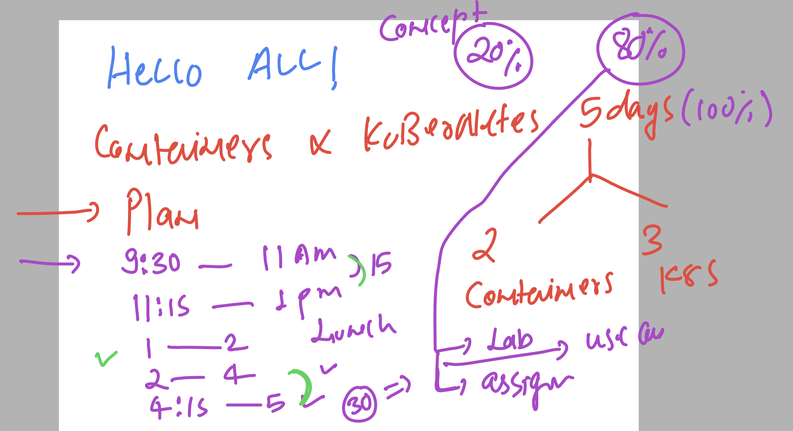

### Plan 



## tech stack 


### isntalling docker compose with aarch64 process

```
curl -L https://github.com/docker/compose/releases/download/v2.24.3/docker-compose-linux-aarch64 -o /usr/bin/docker-compose

chmod +x /usr/bin/docker-compose
docker-compose  version 
Docker Compose version v2.24.3
[root@docker-server yum.repos.d]# 

```
