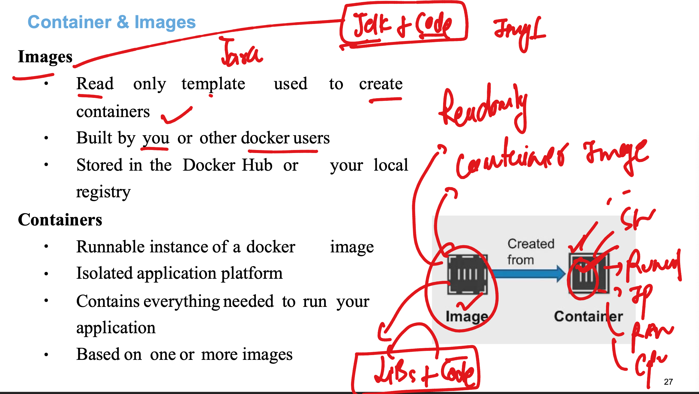
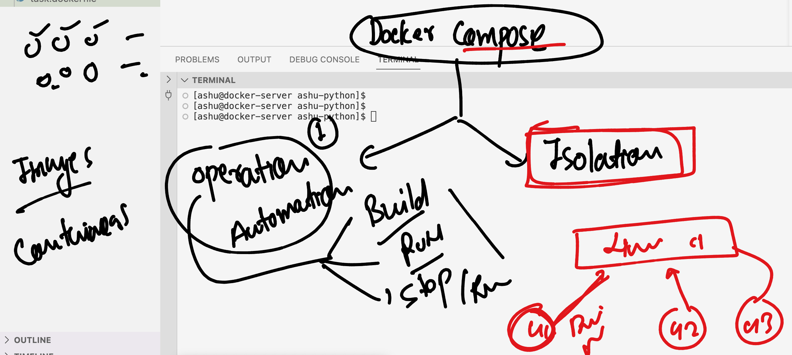
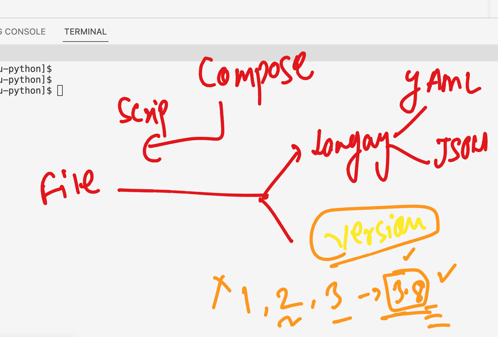

### Understanding problem with bare-metal server


### multiple app compatibality problem solved by HYpervisor -- Vm 


### problem with VM 


### Introduction to containers 


### introduction to container runtimes 


### we are going with Docker software out of many options available 


### Installing docker-engine in oracle linux 7

```
[opc@docker-server ~]$ sudo yum install docker-engine 
Failed to set locale, defaulting to C
Loaded plugins: langpacks, ulninfo
ol7_MySQL80                                                                                             | 3.0 kB  00:00:00     
ol7_MySQL80_connectors_community                                                                        | 2.9 kB  00:00:00     
ol7_MySQL80_tools_community                                                                             | 2.9 kB  00:00:00     
ol7_UEKR6                                                
```

### starting docker service

```
[root@docker-server ~]# systemctl start docker
[root@docker-server ~]# systemctl status docker
● docker.service - Docker Application Container Engine
   Loaded: loaded (/usr/lib/systemd/system/docker.service; disabled; vendor preset: disabled)
   Active: active (running) since Mon 2024-01-29 06:17:11 GMT; 6s ago
     Docs: https://docs.docker.com
 Main PID: 25468 (dockerd)
    Tasks: 9
   Memory: 38.2M
   CGroup: /system.slice/docker.service
           └─25468 /usr/bin/dockerd -H fd:// --containerd=/run/containerd/containerd.sock

Jan 29 06:17:10 docker-server dockerd[25468]: time="2024-01-29T06:17:10.820897171Z" level=warning msg="Your kernel does not support cgroup blkio weight"
Jan 29 06:17:10 docker-server dockerd[25468]: time="2024-01-29T06:17:10.820925931Z" level=warning msg="Your kernel does not support cgroup blkio ...t_device"
Jan 29 06:17:10 docker-server dockerd[25468]: time="2024-01-29T06:17:10.821525490Z" level=info msg="Loading containers: start."
Jan 29 06:17:11 docker-server dockerd[25468]: time="2024-01-29T06:17:11.066427106Z" level=info msg="Default bridge (docker0) is assigned with an ... address"
Jan 29 06:17:11 docker-server dockerd[25468]: time="2024-01-29T06:17:11.198903738Z" level=info msg="Loading containers: done."
Jan 29 06:17:11 docker-server dockerd[25468]: time="2024-01-29T06:17:11.235504041Z" level=warning msg="Not using native diff for overlay2, this m...=overlay2
Jan 29 06:17:11 docker-server dockerd[25468]: time="2024-01-29T06:17:11.235760361Z" level=info msg="Docker daemon" commit=9bb540d graphdriver(s)=....03.11-ol
Jan 29 06:17:11 docker-server dockerd[25468]: time="2024-01-29T06:17:11.235916200Z" level=info msg="Daemon has completed initialization"
Jan 29 06:17:11 docker-server systemd[1]: Started Docker Application Container Engine.
Jan 29 06:17:11 docker-server dockerd[25468]: time="2024-01-29T06:17:11.274943219Z" level=info msg="API listen on /var/run/docker.sock"
Hint: Some lines were ellipsized, use -l to show in full.

### auto-start after reboot 
[root@docker-server ~]# systemctl enable  docker
Created symlink from /etc/systemd/system/multi-user.target.wants/docker.service to /usr/lib/systemd/system/docker.service.
[root@docker-server ~]# 

```

### by default root user in linux can check 

```
[root@docker-server ~]# docker  version 
Client: Docker Engine - Community
 Version:           19.03.11-ol
 API version:       1.40
 Go version:        go1.16.4
 Git commit:        9bb540d
 Built:             Fri Jul 23 01:32:32 2021
 OS/Arch:           linux/arm64
 Experimental:      false

Server: Docker Engine - Community
 Engine:
  Version:          19.03.11-ol
  API version:      1.40 (minimum version 1.12)
  Go version:       go1.16.4
  Git commit:       9bb540d
  Built:            Fri Jul 23 01:31:44 2021
  OS/Arch:          linux/arm64
  Experimental:     false
  Default Registry: docker.io
 containerd:
  Version:          v1.4.8
  GitCommit:        7eba5930496d9bbe375fdf71603e610ad737d2b2
 runc:
  Version:          1.1.7
  GitCommit:        860f061
 docker-init:
  Version:          0.18.0
  GitCommit:        fec3683

```

### lets try with non root user 

```
[ashu@docker-server ~]$ whoami
ashu
[ashu@docker-server ~]$ docker  version 
Client: Docker Engine - Community
 Version:           19.03.11-ol
 API version:       1.40
 Go version:        go1.16.4
 Git commit:        9bb540d
 Built:             Fri Jul 23 01:32:32 2021
 OS/Arch:           linux/arm64
 Experimental:      false
Got permission denied while trying to connect to the Docker daemon socket at unix:///var/run/docker.sock: Get "http://%2Fvar%2Frun%2Fdocker.sock/v1.40/version": dial unix /var/run/docker.sock: connect: permission denied
[ashu@docker-server ~]$ 


```

### Fixing this issues or allow users to connect docker server

```
usermod -aG docker ashu
```

### lets logout that user and login again 

```
[ashu@docker-server ~]$ whoami
ashu
[ashu@docker-server ~]$ docker  version 
Client: Docker Engine - Community
 Version:           19.03.11-ol
 API version:       1.40
 Go version:        go1.16.4
 Git commit:        9bb540d
 Built:             Fri Jul 23 01:32:32 2021
 OS/Arch:           linux/arm64
 Experimental:      false

Server: Docker Engine - Community
 Engine:
  Version:          19.03.11-ol
  API version:      1.40 (minimum version 1.12)
  Go version:       go1.16.4
  Git commit:       9bb540d
  Built:            Fri Jul 23 01:31:44 2021
  OS/Arch:          linux/arm64
  Experimental:     false
  Default Registry: docker.io
 containerd:
  Version:          v1.4.8
  GitCommit:        7eba5930496d9bbe375fdf71603e610ad737d2b2
 runc:
  Version:          1.1.7
  GitCommit:        860f061
 docker-init:
  Version:          0.18.0
  GitCommit:        fec3683

```

### Docker images and containers 



### pulling images from docker hub 

```
[ashu@docker-server ~]$ whoami
ashu
[ashu@docker-server ~]$ docker  images
REPOSITORY          TAG                 IMAGE ID            CREATED             SIZE
[ashu@docker-server ~]$ 
[ashu@docker-server ~]$ 
[ashu@docker-server ~]$ docker  pull  alpine 
Using default tag: latest
Trying to pull repository docker.io/library/alpine ... 
latest: Pulling from docker.io/library/alpine
bca4290a9639: Pull complete 
Digest: sha256:c5b1261d6d3e43071626931fc004f70149baeba2c8ec672bd4f27761f8e1ad6b
Status: Downloaded newer image for alpine:latest
alpine:latest
[ashu@docker-server ~]$ 
[ashu@docker-server ~]$ docker  images
REPOSITORY          TAG                 IMAGE ID            CREATED             SIZE
alpine              latest              ace17d5d883e        2 days ago          7.73MB
[ashu@docker-server ~]$ 


```

### pulling python latest image

```
[ashu@docker-server ~]$ docker  pull python
Using default tag: latest
Trying to pull repository docker.io/library/python ... 
latest: Pulling from docker.io/library/python
5665c1f9a9e1: Pull complete 
f419b1a62fc8: Pull complete 
76b4f1810f99: Pull complete 
1c176cbf6497: Pull complete 
ba0d9396537e: Pull complete 
f93cd5cfd8e8: Pull complete 
cac9244624e2: Pull complete 
84ab309da70c: Pull complete 
Digest: sha256:a09f71f4af992ddf9a620330fed343c850c371251be45c3f9bb46ebeca49c9c6
Status: Downloaded newer image for python:latest
python:latest
[ashu@docker-server ~]$ docker  images
REPOSITORY          TAG                 IMAGE ID            CREATED             SIZE
alpine              latest              ace17d5d883e        2 days ago          7.73MB
python              latest              33039c2f184f        5 weeks ago         1.02GB

```

### Creating first container with default process

```
[ashu@docker-server ~]$ docker  run  --name  ashuc1  -it  -d   alpine:latest 
ee8b471b6af84e007980650286461776d7007375e423c8113d861d17cf6ace4c


[ashu@docker-server ~]$ docker  ps
CONTAINER ID        IMAGE               COMMAND             CREATED             STATUS              PORTS               NAMES
ee8b471b6af8        alpine:latest       "/bin/sh"           3 seconds ago       Up 2 seconds                            ashuc1
[ashu@docker-server ~]$ 


```


### checking resouce consumption of container 

```
docker  stats ashuc1
CONTAINER ID        NAME                CPU %               MEM USAGE / LIMIT     MEM %               NET I/O             BLOCK I/O           PIDS
ee8b471b6af8        ashuc1              0.00%               2.625MiB / 14.85GiB   0.02%               1.46kB / 0B         1.38MB / 0B         1
^C

```

### to exit from above state -- use contr + c 

### stop container and verify 

```
[ashu@docker-server ~]$ docker  stop  ashuc1
ashuc1
[ashu@docker-server ~]$ docker  ps
CONTAINER ID        IMAGE                COMMAND             CREATED             STATUS              PORTS               NAMES
99657f196402        alpine:latest        "/bin/sh"           2 minutes ago       Up 2 minutes                            sandhya1
b66d6b47ca0e        oraclelinux:9-slim   "/bin/bash"         3 minutes ago       Up 3 minutes                            chinta_sunil
30d31faf24f8        alpine:latest        "/bin/sh"           3 minutes ago       Up 3 minutes                            anant1
13ee51ce341a        alpine               "/bin/sh"           4 minutes ago       Up 4 minutes                            sunil
58d3dd491ed3        alpine:latest        "watch -n 5 ls"     5 minutes ago       Up 5 minutes                            dhara2
baf9bd6f7224        alpine               "/bin/sh"           5 minutes ago       Up 5 minutes                            happy_greider
3c262db87829        alpine:latest        "/bin/sh"           5 minutes ago       Up 5 minutes                            vishalc1
8f1d9d4763d6        alpine:latest        "/bin/sh"           5 minutes ago       Up 5 minutes                            kash1
6875c97197db        alpine               "/bin/sh"           5 minutes ago       Up 5 minutes                            rachana1
2208a6d4a41e        alpine:latest        "/bin/sh"           7 minutes ago       Up 7 minutes                            prashanth1
89aec282a3f8        alpine:latest        "/bin/sh"           7 minutes ago       Up 7 minutes                            dhara1
[ashu@docker-server ~]$ 

```

### starting an exited container 

```
[ashu@docker-server ~]$ docker  ps  -a
CONTAINER ID        IMAGE                COMMAND             CREATED             STATUS                            PORTS               NAMES
99657f196402        alpine:latest        "/bin/sh"           3 minutes ago       Exited (137) 40 seconds ago                           sandhya1
b66d6b47ca0e        oraclelinux:9-slim   "/bin/bash"         4 minutes ago       Exited (137) 10 seconds ago                           chinta_sunil
30d31faf24f8        alpine:latest        "/bin/sh"           4 minutes ago       Exited (137) 34 seconds ago                           anant1
af7d8abe2f45        oraclelinux:9-slim   "/bin/bash"         5 minutes ago       Exited (0) 5 minutes ago                              chinta
13ee51ce341a        alpine               "/bin/sh"           5 minutes ago       Exited (137) 10 seconds ago                           sunil
58d3dd491ed3        alpine:latest        "watch -n 5 ls"     5 minutes ago       Exited (137) 9 seconds ago                            dhara2
baf9bd6f7224        alpine               "/bin/sh"           6 minutes ago       Up 6 minutes                                          happy_greider
3c262db87829        alpine:latest        "/bin/sh"           6 minutes ago       Exited (137) 31 seconds ago                           vishalc1
8f1d9d4763d6        alpine:latest        "/bin/sh"           6 minutes ago       Up 6 minutes                                          kash1
6875c97197db        alpine               "/bin/sh"           6 minutes ago       Up 6 minutes                                          rachana1
7d8e2aef532a        oraclelinux:9-slim   "/bin/bash"         7 minutes ago       Exited (0) 7 minutes ago                              charming_dubinsky
17d1f2ea14c7        oraclelinux:7.9      "/bin/bash"         7 minutes ago       Exited (137) 59 seconds ago                           anant
2208a6d4a41e        alpine:latest        "/bin/sh"           8 minutes ago       Exited (137) 47 seconds ago                           prashanth1
89aec282a3f8        alpine:latest        "/bin/sh"           8 minutes ago       Exited (137) 22 seconds ago                           dhara1
ee8b471b6af8        alpine:latest        "/bin/sh"           9 minutes ago       Exited (137) About a minute ago                       ashuc1
[ashu@docker-server ~]$ 
[ashu@docker-server ~]$ docker  start  ashuc1
ashuc1
[ashu@docker-server ~]$ docker ps
CONTAINER ID        IMAGE               COMMAND             CREATED             STATUS              PORTS               NAMES
baf9bd6f7224        alpine              "/bin/sh"           6 minutes ago       Up 6 minutes                            happy_greider
8f1d9d4763d6        alpine:latest       "/bin/sh"           7 minutes ago       Up 7 minutes                            kash1
6875c97197db        alpine              "/bin/sh"           7 minutes ago       Up 7 minutes                            rachana1
ee8b471b6af8        alpine:latest       "/bin/sh"           9 minutes ago       Up 2 seconds                            ashuc1
[ashu@docker-server ~]$ 

```

### we can get shell access of a running container using exec 

```
[ashu@docker-server ~]$ docker   exec  -it  ashuc1  sh 
/ # 
/ # 
/ # whoami
root
/ # ls
bin    dev    etc    home   lib    media  mnt    opt    proc   root   run    sbin   srv    sys    tmp    usr    var
/ # mkdir  helloashutoshh
/ # ls
bin             etc             home            media           opt             root            sbin            sys             usr
dev             helloashutoshh  lib             mnt             proc            run             srv             tmp             var
/ # exit
[ashu@docker-server ~]$ 
[ashu@docker-server ~]$ 
[ashu@docker-server ~]$ 

```

### removing a contaienr 

```
[ashu@docker-server ~]$ docker  stop ashuc1
ashuc1
[ashu@docker-server ~]$ docker  rm  ashuc1
ashuc1
[ashu@docker-server ~]
```

### creating container with custom process

```
[ashu@docker-server ~]$ docker  run -it -d --name ashuc2  alpine  date 
6855f51f7ef4ff759a027dd6895bbdcbadafd2d9980b6b6950ed80ce2c05b23f


[ashu@docker-server ~]$ docker  ps
CONTAINER ID        IMAGE               COMMAND             CREATED             STATUS              PORTS               NAMES
[ashu@docker-server ~]$ 
[ashu@docker-server ~]$


[ashu@docker-server ~]$ docker  ps -a
CONTAINER ID        IMAGE                COMMAND             CREATED             STATUS                      PORTS               NAMES
6855f51f7ef4        alpine               "date"              16 seconds ago      Exited (0) 15 seconds ago                       ashuc2
7d8e2aef532a        oraclelinux:9-slim   "/bin/bash"         15 minutes ago      Exited (0) 15 minutes ago                       charming_dubinsky
[ashu@docker-server ~]$ 
[ashu@docker-server ~]$

[ashu@docker-server ~]$ docker  logs  ashuc2
Mon Jan 29 07:15:04 UTC 2024
[ashu@docker-server ~]$


[ashu@docker-server ~]$ docker rm  ashuc2
ashuc2
[ashu@docker-server ~]$ 

```

### application containerization -- using dockerfile 


## python script containerization 

### hello.py code 

```
import time

while True:
    print("Hello all , welcome to COntainer by Docker..!!")
    time.sleep(3)
    print("Welcome to Oracle India ..")
    time.sleep(2)
    print("this is ashutoshh singh ..!!")
    print("______________________")
    time.sleep(3)
```

### Dockerfile 

```
FROM python
# we are trying to use python image from Docker hub 
LABEL name=ashutoshh
LABEL email=ashutoshh@linux.com 
# label is optional keyword but used for sharing image creator info
RUN mkdir /ashucode 
# to run any command during image build time 
COPY hello.py /ashucode/hello.py 
# during build time my code is getting copied into image 
CMD ["python","/ashucode/hello.py"]
# to define default process of this image 

```
### building docker image 

```
[ashu@docker-server ashu-app-containerization]$ ls
ashu-java  ashu-python
[ashu@docker-server ashu-app-containerization]$ ls  ashu-python/
Dockerfile  hello.py
[ashu@docker-server ashu-app-containerization]$ ls
ashu-java  ashu-python
[ashu@docker-server ashu-app-containerization]$ docker  build  -t  ashupython:v1   ashu-python/ 
Sending build context to Docker daemon  3.072kB
Step 1/6 : FROM python
 ---> 33039c2f184f
Step 2/6 : LABEL name=ashutoshh
 ---> Running in ef4fbd7075b7
Removing intermediate container ef4fbd7075b7
 ---> 2825f7fa6d36
Step 3/6 : LABEL email=ashutoshh@linux.com
 ---> Running in dcb1a6d68f53
Removing intermediate container dcb1a6d68f53
 ---> afd999596f52
Step 4/6 : RUN mkdir /ashucode
 ---> Running in ff58e46bb4d1
Removing intermediate container ff58e46bb4d1
 ---> ce18e4a4edb5
Step 5/6 : COPY hello.py /ashucode/hello.py
 ---> bc911bac571c
Step 6/6 : CMD ["python","/ashucode/hello.py"]
 ---> Running in d3c8c919bb7d
Removing intermediate container d3c8c919bb7d
 ---> 90fefe2036f0
Successfully built 90fefe2036f0
Successfully tagged ashupython:v1
```

### creating container and checking python code output 

```
[ashu@docker-server ashu-app-containerization]$ docker  run -itd  --name ashupyc1  ashupython:v1 
110a0c008e86eeb878d6bb94ceb91667271db454cab2121d149bed4d5e58aaa6
[ashu@docker-server ashu-app-containerization]$ docker  ps
CONTAINER ID        IMAGE               COMMAND                  CREATED             STATUS              PORTS               NAMES
110a0c008e86        ashupython:v1       "python /ashucode/he…"   2 seconds ago       Up 1 second                             ashupyc1
[ashu@docker-server ashu-app-containerization]$ docker logs  ashupyc1
Hello all , welcome to COntainer by Docker..!!
Welcome to Oracle India ..
this is ashutoshh singh ..!!
______________________
Hello all , welcome to COntainer by Docker..!!
[ashu@docker-server ashu-app-containerization]$ docker logs -f  ashupyc1
Hello all , welcome to COntainer by Docker..!!
Welcome to Oracle India ..
this is ashutoshh singh ..!!
______________________
Hello all , welcome to COntainer by Docker..!!
Welcome to Oracle India ..
this is ashutoshh singh ..!!
______________________
Hello all , welcome to COntainer by Docker..!!
Welcome to Oracle India ..
this is ashutoshh singh ..!!
______________________
```

### more operations 

```
[ashu@docker-server ashu-app-containerization]$ docker  stop ashupyc1  
ashupyc1
[ashu@docker-server ashu-app-containerization]$ 
[ashu@docker-server ashu-app-containerization]$ docker  start ashupyc1  
ashupyc1
[ashu@docker-server ashu-app-containerization]$ docker  kill  ashupyc1  
ashupyc1
[ashu@docker-server ashu-app-containerization]$ docker rm  ashupyc1
ashupyc1
[ashu@docker-server ashu-app-containerization]$ 


```

### updating dockerfile to run python code without root user 

### Dockerfile 
```
FROM python
# we are trying to use python image from Docker hub 
LABEL name=ashutoshh
LABEL email=ashutoshh@linux.com 
# label is optional keyword but used for sharing image creator info
RUN mkdir /ashucode 
# to run any command during image build time 
COPY hello.py /ashucode/hello.py 
USER 1001
# above number is just user id in linux container which is for non root user 
# range 1000-60000
# during build time my code is getting copied into image 
CMD ["python","/ashucode/hello.py"]
# to define default process of this image 

```

### rebuild and recreate is required 

```
docker  build  -t  ashupython:rootlessv1    ashu-python/


====>> Recreate

[ashu@docker-server ashu-app-containerization]$ docker run -itd  --name ashupyc2   ashupython:rootlessv1 
f921c76573a4704167aaaad142c4c5eec58feb93079114216be8396132c0bd0a
[ashu@docker-server ashu-app-containerization]$ docker  ps
CONTAINER ID        IMAGE                   COMMAND                  CREATED             STATUS              PORTS               NAMES
f921c76573a4        ashupython:rootlessv1   "python /ashucode/he…"   2 seconds ago       Up 1 second                             ashupyc2
eb17e3126a36        ashupython:v1           "python /ashucode/he…"   2 minutes ago       Up 2 minutes                            ashupyc1
7702dad5cf49        paragpython:v1          "python /paragcode/h…"   8 minutes ago       Up 8 minutes                            paragpy1
[ashu@docker-server ashu-app-containerization]$ docker logs ashupyc2
Hello all , welcome to COntainer by Docker..!!
Welcome to Oracle India ..
this is ashutoshh singh ..!!
______________________
Hello all , welcome to COntainer by Docker..!!
[ashu@docker-server ashu-app-containerization]$ docker  exec -it ashupyc2  bash 
I have no name!@f921c76573a4:/$ 
I have no name!@f921c76573a4:/$ 
I have no name!@f921c76573a4:/$ whoami
whoami: cannot find name for user ID 1001
I have no name!@f921c76573a4:/$ id
uid=1001 gid=0(root) groups=0(root)
I have no name!@f921c76573a4:/$ 
exit
```

### Official python image size is 1GB -- lets try with oraclelinux image

### dockerfile

```
FROM oraclelinux:8.4 
# we are trying to use python image from Docker hub 
LABEL name=ashutoshh
LABEL email=ashutoshh@linux.com 
# label is optional keyword but used for sharing image creator info
RUN mkdir /ashucode 
RUN dnf install python3 -y 
# to run any command during image build time 
COPY hello.py /ashucode/hello.py 
USER 1001
# above number is just user id in linux container which is for non root user 
# range 1000-60000
# during build time my code is getting copied into image 
CMD ["python3","/ashucode/hello.py"]
# to define default process of this image 

```

### build and test it 

```
ashu@docker-server ashu-app-containerization]$ ls
ashu-java  ashu-python
[ashu@docker-server ashu-app-containerization]$ cd  ashu-python/
[ashu@docker-server ashu-python]$ ls
Dockerfile  hello.py  oraclelinux.dockerfile
[ashu@docker-server ashu-python]$ 
[ashu@docker-server ashu-python]$ docker build -t ashupython:oraclelinux84  -f  oraclelinux.dockerfile  . 
Sending build context to Docker daemon   5.12kB
Step 1/8 : FROM oraclelinux:8.4
 ---> 034c11d3a502
Step 2/8 : LABEL name=ashutoshh
 ---> Running in 215f4aa6f14f
Removing intermediate container 215f4aa6f14f
 ---> 33720b23c143
Step 3/8 : LABEL email=ashutoshh@linux.com
 ---> Running in 43b7261431d9
Removing intermediate container 43b7261431d9
 ---> 9600bfa29acf
Step 4/8 : RUN mkdir /ashucode
 ---> Running in a5baec9b3bd2
Removing intermediate container a5baec9b3bd2
 ---> 230a3fee3c5b
Step 5/8 : RUN dnf install python3 -y
 ---> Running in c984df9e8536
Oracle Linux 8 BaseOS Latest (aarch64)          123 MB/s |  97 MB     00:00    


```

### testing and comparing 

```
[root@docker-server ~]# docker  images  | grep ashu
ashupython          oraclelinux84       8e3500e20249        33 seconds ago      589MB
ashupython          rootlessv1          3c348dffa175        16 minutes ago      1.02GB
ashupython          v1                  90fefe2036f0        33 minutes ago      1.02GB
[root@docker-server ~]# 
[root@docker-server ~]# 
[root@docker-server ~]# docker  run -itd --name ashupy  ashupython:oraclelinux84
27c729f4ff3cafb7ec545de76dcde4f7843e355b06340cb69701c6b8ae6d08eb
[root@docker-server ~]# docker  ps
CONTAINER ID        IMAGE                      COMMAND                  CREATED             STATUS              PORTS               NAMES
27c729f4ff3c        ashupython:oraclelinux84   "python3 /ashucode/h…"   2 seconds ago       Up 1 second                             ashupy
0f0c20e34c08        sunil:v2                   "python main.py"         2 minutes ago       Up 2 minutes                            reverent_jepsen
c2534ae9cad2        rachpython2:rootless       "python /rachcode/he…"   13 minutes ago      Up 13 minutes                           secondhellopython_rach
e3e07b703da0        sandhyapyimg:v1            "python /sandhyacode…"   13 minutes ago      Up 13 minutes                           sandhyapyc2
4a0ee634abbb        praspython1:rootlessv1     "python /prascode/he…"   15 minutes ago      Up 15 minutes                           praspyrootless
7702dad5cf49        paragpython:v1             "python /paragcode/h…"   25 minutes ago      Up 25 minutes                           paragpy1
[root@docker-server ~]# docker logs ashupy
Hello all , welcome to COntainer by Docker..!!
Welcome to Oracle India ..
this is ashutoshh singh ..!!
______________________
Hello all , welcome to COntainer by Docker..!!
[root@docker-server ~]# docker  exec -it ashupy bash 
bash-4.4$ 
bash-4.4$ 
bash-4.4$ id
uid=1001 gid=0(root) groups=0(root)
bash-4.4$ 
bash-4.4$ 

```


### task1  Solution 

```
FROM alpine 
RUN apk add python3
RUN mkdir /code
ADD https://raw.githubusercontent.com/redashu/pythonLang/main/while.py /code/
CMD ["python3","/code/while.py"]

```

### Introduction to docker compose 



### info about docker-compose file 



### adding docker-compose.yaml 

```
version:  '3.8'
services: 
  pythonashuapp: # name of service 
    image: ashupyimg:v1  # image i want to build 
    build: .  # location of Dockerfile 
    container_name: ashupyc1 

```


