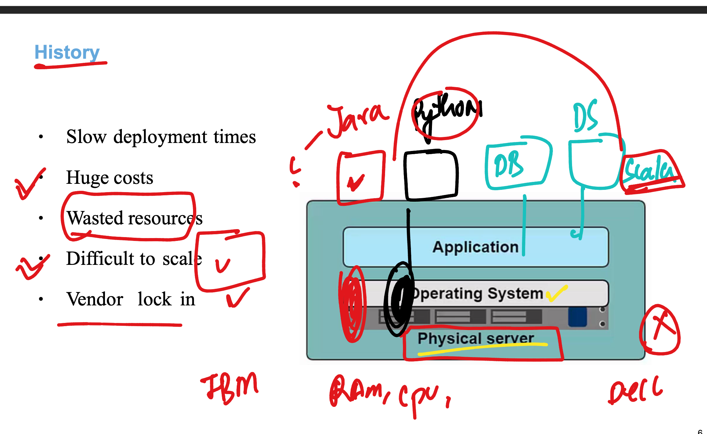
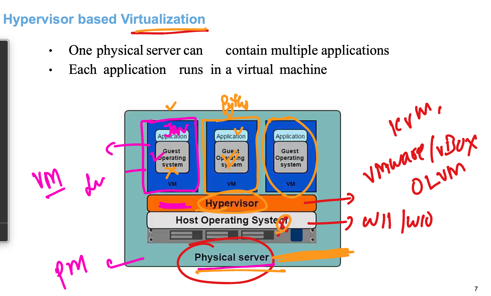
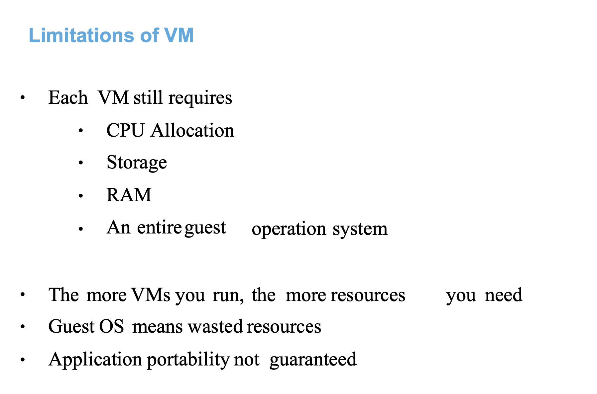
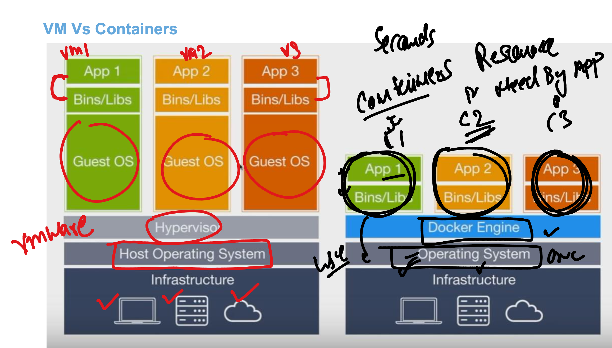
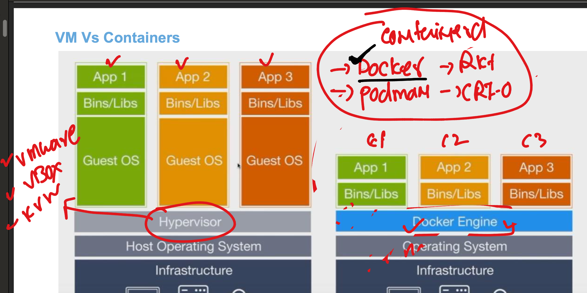
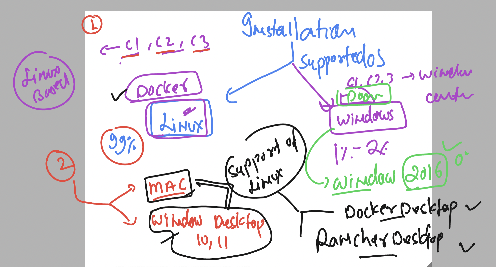

### Understanding problem with bare-metal server



### multiple app compatibality problem solved by HYpervisor -- Vm 



### problem with VM 



### Introduction to containers 



### introduction to container runtimes 



### we are going with Docker software out of many options available 



### Installing docker-engine in oracle linux 7

```
[opc@docker-server ~]$ sudo yum install docker-engine 
Failed to set locale, defaulting to C
Loaded plugins: langpacks, ulninfo
ol7_MySQL80                                                                                             | 3.0 kB  00:00:00     
ol7_MySQL80_connectors_community                                                                        | 2.9 kB  00:00:00     
ol7_MySQL80_tools_community                                                                             | 2.9 kB  00:00:00     
ol7_UEKR6                                                
```

### starting docker service

```
[root@docker-server ~]# systemctl start docker
[root@docker-server ~]# systemctl status docker
● docker.service - Docker Application Container Engine
   Loaded: loaded (/usr/lib/systemd/system/docker.service; disabled; vendor preset: disabled)
   Active: active (running) since Mon 2024-01-29 06:17:11 GMT; 6s ago
     Docs: https://docs.docker.com
 Main PID: 25468 (dockerd)
    Tasks: 9
   Memory: 38.2M
   CGroup: /system.slice/docker.service
           └─25468 /usr/bin/dockerd -H fd:// --containerd=/run/containerd/containerd.sock

Jan 29 06:17:10 docker-server dockerd[25468]: time="2024-01-29T06:17:10.820897171Z" level=warning msg="Your kernel does not support cgroup blkio weight"
Jan 29 06:17:10 docker-server dockerd[25468]: time="2024-01-29T06:17:10.820925931Z" level=warning msg="Your kernel does not support cgroup blkio ...t_device"
Jan 29 06:17:10 docker-server dockerd[25468]: time="2024-01-29T06:17:10.821525490Z" level=info msg="Loading containers: start."
Jan 29 06:17:11 docker-server dockerd[25468]: time="2024-01-29T06:17:11.066427106Z" level=info msg="Default bridge (docker0) is assigned with an ... address"
Jan 29 06:17:11 docker-server dockerd[25468]: time="2024-01-29T06:17:11.198903738Z" level=info msg="Loading containers: done."
Jan 29 06:17:11 docker-server dockerd[25468]: time="2024-01-29T06:17:11.235504041Z" level=warning msg="Not using native diff for overlay2, this m...=overlay2
Jan 29 06:17:11 docker-server dockerd[25468]: time="2024-01-29T06:17:11.235760361Z" level=info msg="Docker daemon" commit=9bb540d graphdriver(s)=....03.11-ol
Jan 29 06:17:11 docker-server dockerd[25468]: time="2024-01-29T06:17:11.235916200Z" level=info msg="Daemon has completed initialization"
Jan 29 06:17:11 docker-server systemd[1]: Started Docker Application Container Engine.
Jan 29 06:17:11 docker-server dockerd[25468]: time="2024-01-29T06:17:11.274943219Z" level=info msg="API listen on /var/run/docker.sock"
Hint: Some lines were ellipsized, use -l to show in full.

### auto-start after reboot 
[root@docker-server ~]# systemctl enable  docker
Created symlink from /etc/systemd/system/multi-user.target.wants/docker.service to /usr/lib/systemd/system/docker.service.
[root@docker-server ~]# 

```

### by default root user in linux can check 

```
[root@docker-server ~]# docker  version 
Client: Docker Engine - Community
 Version:           19.03.11-ol
 API version:       1.40
 Go version:        go1.16.4
 Git commit:        9bb540d
 Built:             Fri Jul 23 01:32:32 2021
 OS/Arch:           linux/arm64
 Experimental:      false

Server: Docker Engine - Community
 Engine:
  Version:          19.03.11-ol
  API version:      1.40 (minimum version 1.12)
  Go version:       go1.16.4
  Git commit:       9bb540d
  Built:            Fri Jul 23 01:31:44 2021
  OS/Arch:          linux/arm64
  Experimental:     false
  Default Registry: docker.io
 containerd:
  Version:          v1.4.8
  GitCommit:        7eba5930496d9bbe375fdf71603e610ad737d2b2
 runc:
  Version:          1.1.7
  GitCommit:        860f061
 docker-init:
  Version:          0.18.0
  GitCommit:        fec3683

```

### lets try with non root user 

```
[ashu@docker-server ~]$ whoami
ashu
[ashu@docker-server ~]$ docker  version 
Client: Docker Engine - Community
 Version:           19.03.11-ol
 API version:       1.40
 Go version:        go1.16.4
 Git commit:        9bb540d
 Built:             Fri Jul 23 01:32:32 2021
 OS/Arch:           linux/arm64
 Experimental:      false
Got permission denied while trying to connect to the Docker daemon socket at unix:///var/run/docker.sock: Get "http://%2Fvar%2Frun%2Fdocker.sock/v1.40/version": dial unix /var/run/docker.sock: connect: permission denied
[ashu@docker-server ~]$ 


```

### Fixing this issues or allow users to connect docker server

```
usermod -aG docker ashu
```

### lets logout that user and login again 

```
[ashu@docker-server ~]$ whoami
ashu
[ashu@docker-server ~]$ docker  version 
Client: Docker Engine - Community
 Version:           19.03.11-ol
 API version:       1.40
 Go version:        go1.16.4
 Git commit:        9bb540d
 Built:             Fri Jul 23 01:32:32 2021
 OS/Arch:           linux/arm64
 Experimental:      false

Server: Docker Engine - Community
 Engine:
  Version:          19.03.11-ol
  API version:      1.40 (minimum version 1.12)
  Go version:       go1.16.4
  Git commit:       9bb540d
  Built:            Fri Jul 23 01:31:44 2021
  OS/Arch:          linux/arm64
  Experimental:     false
  Default Registry: docker.io
 containerd:
  Version:          v1.4.8
  GitCommit:        7eba5930496d9bbe375fdf71603e610ad737d2b2
 runc:
  Version:          1.1.7
  GitCommit:        860f061
 docker-init:
  Version:          0.18.0
  GitCommit:        fec3683

```
