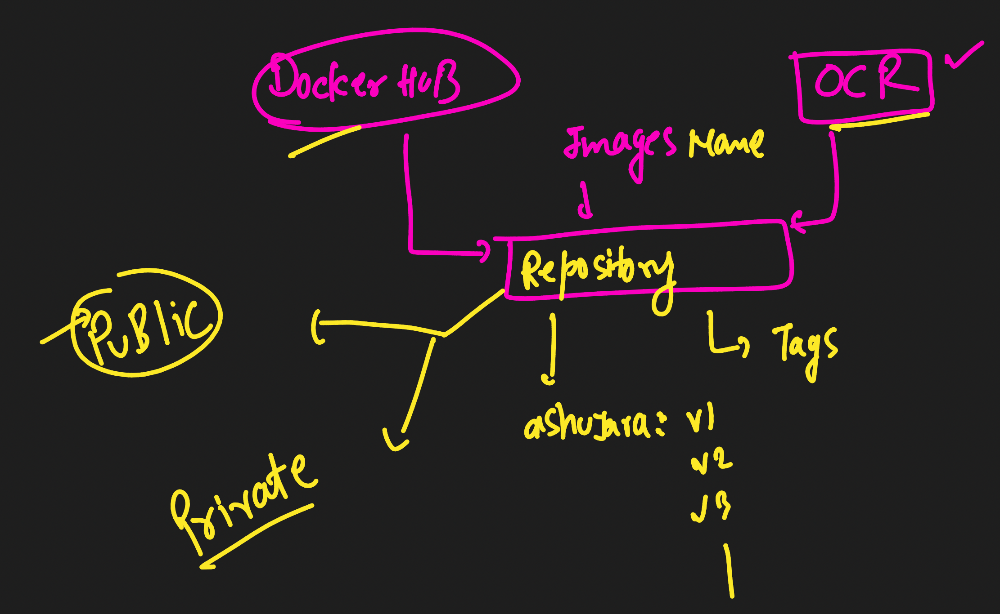
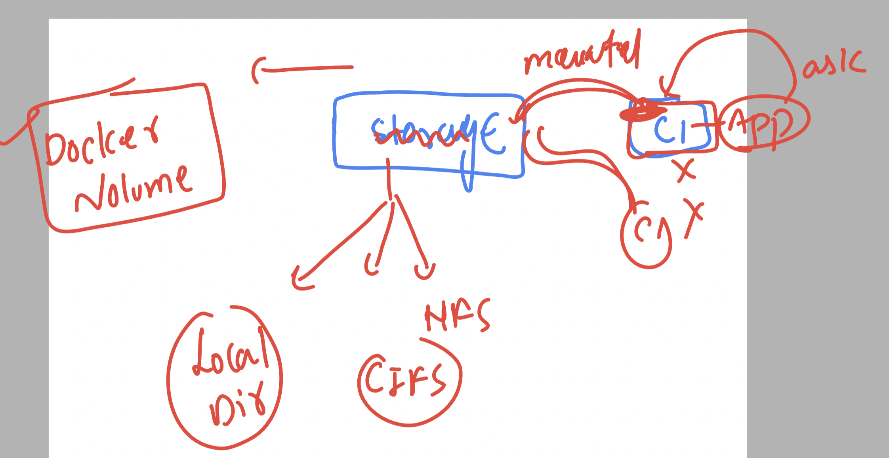

## Revision 


### introduction to web server 


### Intro to nginx 


## web app containerization using nginx 

### taking source code 

```
 git clone https://github.com/codingstella/vCard-personal-portfolio.git
```

### given content in current directory 

```
[ashu@docker-server ashu-ui-app]$ ls
docker-compose.yaml  Dockerfile  vCard-personal-portfolio
[ashu@docker-server ashu-ui-app]$ ls -a vCard-personal-portfolio/
.  ..  assets  .git  index.html  index.txt  README.md  website-demo-image
[ashu@docker-server ashu-ui-app]$ 

```

### dockerfile

```
FROM nginx 
LABEL name=ashutoshh
COPY vCard-personal-portfolio /usr/share/nginx/html/
```

### .dockerignore

```
vCard-personal-portfolio/.git
vCard-personal-portfolio/index.txt
vCard-personal-portfolio/README.md
```

### docker-compose.yaml 

```
version: '3.8'
services:
  ashu-ui-app:
    image: ashunginx:appv1
    build:
      context: .
      dockerfile: Dockerfile 
    container_name: ashuwebc1 
```

### let me run it 

```
ashu@docker-server ashu-ui-app]$ ls
docker-compose.yaml  Dockerfile  vCard-personal-portfolio
[ashu@docker-server ashu-ui-app]$ docker-compose  up -d
[+] Running 0/1
 ⠇ ashu-ui-app Pulling                                                                                                                              1.8s 
[+] Building 10.1s (7/7) FINISHED                                                                                                         docker:default
 => [ashu-ui-app internal] load build definition from Dockerfile                                                                                    0.0s
 => => transferring dockerfile: 181B                                                                                                                0.0s
 => [ashu-ui-app internal] load .dockerignore                                                                                                       0.0s
 => => transferring context: 198B                                                                                                                   0.0s
 => [ashu-ui-app internal] load metadata for docker.io/library/nginx:latest                                                                         2.3s
 => [ashu-ui-app internal] load build context                                                                                                       0.0s
 => => transferring context: 1.28MB                                                                                                                 0.0s
 => [ashu-ui-app 1/2] FROM docker.io/library/nginx@sha256:4c0fdaa8b6341bfdeca5f18f7837462c80cff90527ee35ef185571e1c327beac                          4.7s
 => => resolve docker.io/library/nginx@sha256:4c0fdaa8b6341bfdeca5f18f7837462c80cff90527ee35ef185571e1c327beac                                      0.0s
 => => sha256:523c417937604bc107d799e5cad1ae2ca8a9fd46306634fa2c547dc6220ec17c 1.99kB / 1.99kB                                                      0.0s
 => => sha256:4c0fdaa8b6341bfdeca5f18f7837462c80cff90527ee35ef185571e1c327beac 7.59kB / 7.59kB                                                      0.0s
 => => sha256:a5573528b1f0cf2f5d87c94fe0aee9d8967d5de98258be9303c3c6fa477824ec 29.16MB / 29.16MB                                                    1.5s
 => => sha256:8897d65c841707a2f02937de91c6644ba9699bd3ad194bdd84d2b61a93ca12f2 38.04MB / 38.04MB                                                    1.5s
 => => sha256:fbc138d1d206d59261b82b2c537e7819ca8f46c63ce80b4906394a8b83ea896a 627B / 627B                                                          0.5s
 => => sha256:6c7be49d2a11cfab9a87362ad27d447b45931e43dfa6919a8e1398ec09c1e353 7.02kB / 7.02kB                                                      0.0s
 => => sha256:06f386eb918297ce19936107ccb010187b2d6a95ba8bd60073610d371289b46c 955B / 955B                                                          0.7s
 => => sha256:aeb2f3db77c35ab11eccb3643b18e72e1085fcc42343078da8d72b76a6fd5b44 363B / 363B                                                          0.9s
 => => sha256:64fb762834ec1a0ca5d5980d4f810342d9fe5f1cf96b4d4bf2d4a27a564778ca 1.21kB / 1.21kB                                                      1.2s
 => => sha256:e5a7e61f6ff45ab19ba3bad8bfc4e38cdafbbca0cefcf1f81516bb14b6476557 1.40kB / 1.40kB                                                      1.5s
 => => extracting sha256:a5573528b1f0cf2f5d87c94fe0aee9d8967d5de98258be9303c3c6fa477824ec                                                           1.4s
 => => extracting sha256:8897d65c841707a2f02937de91c6644ba9699bd3ad194bdd84d2b61a93ca12f2                                                           1.3s
 => => extracting sha256:fbc138d1d206d59261b82b2c537e7819ca8f46c63ce80b4906394a8b83ea896a                                                           0.0s
 => => extracting sha256:06f386eb918297ce19936107ccb010187b2d6a95ba8bd60073610d371289b46c                                                           0.0s
 => => extracting sha256:aeb2f3db77c35ab11eccb3643b18e72e1085fcc42343078da8d72b76a6fd5b44                                                           0.0s
 => => extracting sha256:64fb762834ec1a0ca5d5980d4f810342d9fe5f1cf96b4d4bf2d4a27a564778ca                                                           0.0s
 => => extracting sha256:e5a7e61f6ff45ab19ba3bad8bfc4e38cdafbbca0cefcf1f81516bb14b6476557                                                           0.0s
 => [ashu-ui-app 2/2] COPY vCard-personal-portfolio /usr/share/nginx/html/                                                                          2.0s
 => [ashu-ui-app] exporting to image                                                                                                                1.0s
 => => exporting layers                                                                                                                             1.0s
 => => writing image sha256:9c752ac20c3c62a396e0674d1294b113253413e6db5dbbd767c5610ed1c852fa                                                        0.0s
 => => naming to docker.io/library/ashunginx:appv1                                                                                                  0.0s
[+] Running 1/2
 ⠴ Network ashu-ui-app_default  Created                                                                                                             0.5s 
 ✔ Container ashuwebc1          Started                            
```

### container networking 


### checking default bridges in docker host

```
[ashu@docker-server ashu-ui-app]$ docker  network  ls
NETWORK ID          NAME                DRIVER              SCOPE
4db0af884895        bridge              bridge              local
78ab40a4863f        host                host                local
82c017b7df87        none                null                local


[ashu@docker-server ashu-ui-app]$ docker  network  inspect  4db0af884895
[
    {
        "Name": "bridge",
        "Id": "4db0af884895f18aed46ce650a8ab2809cf7f057c274f0a5168691f99e97e199",
        "Created": "2024-01-30T03:52:01.83798405Z",
        "Scope": "local",
        "Driver": "bridge",
        "EnableIPv6": false,
        "IPAM": {
            "Driver": "default",
            "Options": null,
            "Config": [
                {
                    "Subnet": "172.17.0.0/16",
                    "Gateway": "172.17.0.1"
                }
            ]
        },
        "Internal": false,
        "Attachable": false,
        "Ingress": false,
        "ConfigFrom": {
            "Network": ""
        },
        "ConfigOnly": false,
        "Containers": {},
        "Options": {
            "com.docker.network.bridge.default_bridge": "true",
            "com.docker.network.bridge.enable_icc": "true",
            "com.docker.network.bridge.enable_ip_masquerade": "true",
            "com.docker.network.bridge.host_binding_ipv4": "0.0.0.0",
            "com.docker.network.bridge.name": "docker0",
            "com.docker.network.driver.mtu": "1500"
        },
        "Labels": {}
    }
]
```

### testing other containers connecting 

```
[ashu@docker-server ashu-ui-app]$ docker ps
CONTAINER ID        IMAGE               COMMAND             CREATED              STATUS              PORTS               NAMES
5a7380d4a5fe        alpine              "/bin/sh"           45 seconds ago       Up 45 seconds                           sandhyac1
54284cd77cb6        alpine              "/bin/sh"           About a minute ago   Up About a minute                       paragtest
a20d8f84bdb8        alpine              "/bin/sh"           About a minute ago   Up About a minute                       rachnwtest
35a869ea7038        alpine              "/bin/sh"           About a minute ago   Up About a minute                       anantc1
6369c68e551a        alpine              "/bin/sh"           About a minute ago   Up About a minute                       vishalc1
8a2995c2b86a        alpine              "/bin/sh"           2 minutes ago        Up About a minute                       prasc1
a9d22921bd74        alpine              "/bin/sh"           2 minutes ago        Up 2 minutes                            dhara-c1
d78fb8d61c47        alpine              "/bin/sh"           2 minutes ago        Up 2 minutes                            ashuc1
[ashu@docker-server ashu-ui-app]$ docker  exec -it ashuc1  sh 
/ # 
/ # ping  172.17.0.6
PING 172.17.0.6 (172.17.0.6): 56 data bytes
64 bytes from 172.17.0.6: seq=0 ttl=64 time=0.163 ms
64 bytes from 172.17.0.6: seq=1 ttl=64 time=0.082 ms
^C
--- 172.17.0.6 ping statistics ---
2 packets transmitted, 2 packets received, 0% packet loss
round-trip min/avg/max = 0.082/0.122/0.163 ms
/ # 
/ # exit
```

### container can access internet using host IP -- via NAT method 


### custom bridges and port forwarding 


### if we are using docker cli then port forwarding 

```
docker run -itd --name c1  -p 1234:80 ashunginx:appv1 
```

### adding port forwading in compose and rerun it 

```
version: '3.8'
services:
  ashu-ui-app:
    image: ashunginx:appv1
    build:
      context: .
      dockerfile: Dockerfile 
    container_name: ashuwebc1 
    ports: # host port range you can use 1024 - 60k (we can use lower port also)
    - 1235:80 # here left side is host port and right side is container port


```

###

```
ashu@docker-server ashu-ui-app]$ docker-compose  up -d
[+] Running 1/1
 ✔ Container ashuwebc1  Started                                                                          0.3s 
[ashu@docker-server ashu-ui-app]$ docker-compose  ps
NAME        IMAGE             COMMAND                  SERVICE       CREATED         STATUS         PORTS
ashuwebc1   ashunginx:appv1   "/docker-entrypoint.…"   ashu-ui-app   4 seconds ago   Up 4 seconds   0.0.0.0:1235->80/tcp
[ashu@docker-server ashu-ui-app]$ 

```

### allow internal and external firewall rules 

```
[root@docker-server ~]# systemctl enable --now firewalld
Created symlink from /etc/systemd/system/dbus-org.fedoraproject.FirewallD1.service to /usr/lib/systemd/system/firewalld.service.
Created symlink from /etc/systemd/system/multi-user.target.wants/firewalld.service to /usr/lib/systemd/system/firewalld.service.
[root@docker-server ~]# 
[root@docker-server ~]# 
[root@docker-server ~]# firewall-cmd  --add-port=1024-10000/tcp --permanent 
success
[root@docker-server ~]# firewall-cmd --reload 
success
[root@docker-server ~]# 

```

### Multiple stage projects


### current workding directory strcture 

```
[ashu@docker-server ashu-ui-app]$ ls -a
.  ..  ashu-walm-mvnweb  docker-compose.yaml  Dockerfile  .dockerignore  spring.dockerfile  vCard-personal-portfolio
[ashu@docker-server ashu-ui-app]$ 


```

### spring.dockerfile

```
FROm oraclelinux:8.4  as Builder
RUN dnf install java-11-openjdk.aarch64 java-11-openjdk-devel.aarch64 maven -y
WORKDIR /mycode 
# to create directory and change location also 
COPY ashu-walm-mvnweb  .
RUN mvn install 
# above command will compile | test | create .war file under target ashuwebjava.war

FROM tomcat 
LABEL name=ashutoshh
LABEL email=ashutoshh@linux.com 
COPY --from=Builder  /mycode/target/ashuwebjava.war /usr/local/tomcat/webapps/

```

### docker-compose.yaml

```
version: '3.8'
services:
  ashu-java-project:
    image: ashutomcat:appv1
    build:
      context: .
      dockerfile: spring.dockerfile
    container_name: ashujavac1 
    ports:
    - 8899:8080

  ashu-ui-app:
    image: ashunginx:appv1
    build:
      context: .
      dockerfile: Dockerfile 
    container_name: ashuwebc1 
    ports: # host port range you can use 1024 - 60k (we can use lower port also)
    - 1235:80 # here left side is host port and right side is container port


```

###  .dockerignore

```
vCard-personal-portfolio/.git
vCard-personal-portfolio/index.txt
vCard-personal-portfolio/README.md
ashu-walm-mvnweb/.git
ashu-walm-mvnweb/README.md
```

## Rebuild and test it 

```
docker-compose up -d --build
[ashu@docker-server ashu-ui-app]$ docker-compose  ps
NAME         IMAGE              COMMAND                  SERVICE             CREATED         STATUS         PORTS
ashujavac1   ashutomcat:appv1   "catalina.sh run"        ashu-java-project   2 minutes ago   Up 2 minutes   0.0.0.0:8899->8080/tcp
ashuwebc1    ashunginx:appv1    "/docker-entrypoint.…"   ashu-ui-app         2 minutes ago   Up 2 minutes   0.0.0.0:1235->80/tcp
```

### adding custom bridge name in docker-compose file 

```
version: '3.8'
networks: # creating custom bridge by defining it 
  ashubr1: # name of bridge 
services:
  ashu-java-project:
    image: ashutomcat:appv1
    build:
      context: .
      dockerfile: spring.dockerfile
    container_name: ashujavac1 
    networks:
    - ashubr1 
    ports:
    - 8899:8080

  ashu-ui-app:
    image: ashunginx:appv1
    build:
      context: .
      dockerfile: Dockerfile 
    container_name: ashuwebc1 
    networks:
    - ashubr1
    ports: # host port range you can use 1024 - 60k (we can use lower port also)
    - 1235:80 # here left side is host port and right side is container port


```

### Understanding registry 


### examples 


### repository in registry



## PUshing image to docker hub 

### tagging 

```
docker  tag   ashunginx:appv1    docker.io/dockerashu/ashuoracletest:version1 
```

### login 

```
[ashu@docker-server ashu-ui-app]$ docker  login 
Login with your Docker ID to push and pull images from Docker Hub. If you don't have a Docker ID, head over to https://hub.docker.com to create one.
Username: dockerashu
Password: 
WARNING! Your password will be stored unencrypted in /home/ashu/.docker/config.json.
Configure a credential helper to remove this warning. See
https://docs.docker.com/engine/reference/commandline/login/#credentials-store

Login Succeeded
```

### push it

```
[ashu@docker-server ashu-ui-app]$ docker  push docker.io/dockerashu/ashuoracletest:version1
The push refers to repository [docker.io/dockerashu/ashuoracletest]
a4f1b1145b2f: Pushed 
```

### optional -- logout 

```
[ashu@docker-server ashu-ui-app]$ docker logout
Removing login credentials for https://index.docker.io/v1/
```

### pushing image to Oracle Container registry 

```
[ashu@docker-server ashu-ui-app]$  docker  tag   ashunginx:appv1  ap-mumbai-1.ocir.io/bmfqoyqvmham/oracleapps:version1 
[ashu@docker-server ashu-ui-app]$ 
[ashu@docker-server ashu-ui-app]$ docker login  ap-mumbai-1.ocir.io
Username: bmfqoyqvmham/hvkataria12@gmail.com
Password: 
WARNING! Your password will be stored unencrypted in /home/ashu/.docker/config.json.
Configure a credential helper to remove this warning. See
https://docs.docker.com/engine/reference/commandline/login/#credentials-store

Login Succeeded
[ashu@docker-server ashu-ui-app]$ docker  push  ap-mumbai-1.ocir.io/bmfqoyqvmham/oracleapps:version1
The push refers to repository [ap-mumbai-1.ocir.io/bmfqoyqvmham/oracleapps]
a4f1b1145b2f: Pushed 
3aaeb64b961e: Pushed 
13b225d31940: Pushed 
cdaa6b69c4f7: Pushed 
ba8df9f6e08a: Pushed 
03f8fa0bab3f: Pushed 
6831250ac8b4: Pushed 
6f2d01c02c30: Pushed 
version1: digest: sha256:741ba2e2cdd55fdbaf9154627bdfaf426dab9f4e358764d888f6ff7310104abf size: 1989
[ashu@docker-server ashu-ui-app]$ 
[ashu@docker-server ashu-ui-app]$ docker logout ap-mumbai-1.ocir.io
Removing login credentials for ap-mumbai-1.ocir.io
[ashu@docker-server ashu-ui-app]$ 
```

### solution of task container data copy 

```
[root@docker-server ~]# docker run -itd --name ashuc11  alpine 
19d53ecd0bee254e82ee8d8d500e37058a8fca299d982506e93c844bc6086a65
[root@docker-server ~]# docker run -itd --name ashuc22  alpine 
98707d3b0a40cd9df446c30d79814fa5d777e3f60c5dc7ffe9f440a465e178a3
[root@docker-server ~]# 
[root@docker-server ~]# 
[root@docker-server ~]# docker  exec -it  ashuc11 sh 
/ # 
/ # 
/ # ls
bin    dev    etc    home   lib    media  mnt    opt    proc   root   run    sbin   srv    sys    tmp    usr    var
/ # pwd
/
/ # echo hello world >helloc1.txt
/ # ls
bin          etc          home         media        opt          root         sbin         sys          usr
dev          helloc1.txt  lib          mnt          proc         run          srv          tmp          var
/ # cat helloc1.txt 
hello world
/ # 
/ # exit
[root@docker-server ~]# 
[root@docker-server ~]# docker  cp  ashuc11:/helloc1.txt   .
[root@docker-server ~]# ls
helloc1.txt  users.txt
[root@docker-server ~]# docker  cp  helloc1.txt   ashuc22:/
[root@docker-server ~]# docker  exec ashuc22 ls /
bin
dev
etc
helloc1.txt
home
lib
media
mnt
opt
proc

```

## compose based solution 

```
version: '3.8'
services:
  ashusvc1:
    image: alpine
    tty: true
    container_name: ashuc111
  ashusvc2:
    image: alpine
    tty: true
    container_name: ashuc222
```
### 

```
[ashu@docker-server tasks_ashu]$ docker-compose  up -d
[+] Running 2/3
 ⠴ Network tasks_ashu_default  Created                                                                   0.5s 
 ✔ Container ashuc111          Started                                                                   0.4s 
 ✔ Container ashuc222          Started                                                                   0.4s 
[ashu@docker-server tasks_ashu]$ docker-compose  ps
NAME       IMAGE     COMMAND     SERVICE    CREATED         STATUS         PORTS
ashuc111   alpine    "/bin/sh"   ashusvc1   4 seconds ago   Up 3 seconds   
ashuc222   alpine    "/bin/sh"   ashusvc2   4 seconds ago   Up 3 seconds   
[ashu@docker-server tasks_ashu]$ docker-compose  exec ashusvc1  sh 
/ # echo hellodata >helloc1.txt
/ # ls
bin          helloc1.txt  media        proc         sbin         tmp
dev          home         mnt          root         srv          usr
etc          lib          opt          run          sys          var
/ # exit
[ashu@docker-server tasks_ashu]$ docker-compose  cp ashusvc1:/helloc1.txt   . 
[+] Copying 1/0
 ✔ ashuc111 copy ashuc111:/helloc1.txt to . Copied                                                       0.0s 
[ashu@docker-server tasks_ashu]$ ls
compose.yaml  helloc1.txt
[ashu@docker-server tasks_ashu]$ docker-compose  cp helloc1.txt ashusvc2:/ 
[+] Copying 1/0
 ✔ ashuc222 copy helloc1.txt to ashuc222:/ Copied                                                        0.0s 
[ashu@docker-server tasks_ashu]$ 
```

### Intro to docker storage



### creating a docker volume 

```
[root@docker-server docker]# docker  volume  create  ashu-volume1
ashu-volume1
[root@docker-server docker]# 
[root@docker-server docker]# 
[root@docker-server docker]# docker  volume  ls
DRIVER              VOLUME NAME
local               ashu-volume1
[root@docker-server docker]# 


```

### inspecting 

```
[root@docker-server docker]# docker volume inspect  ashu-volume1
[
    {
        "CreatedAt": "2024-01-30T09:56:11Z",
        "Driver": "local",
        "Labels": {},
        "Mountpoint": "/var/lib/docker/volumes/ashu-volume1/_data",
        "Name": "ashu-volume1",
        "Options": {},
        "Scope": "local"
    }
]

```

### creating and using 

```
[root@docker-server docker]# docker  volume  ls
DRIVER              VOLUME NAME
local               anant-vol1
local               ashu-volume1
local               dhara-vol-1
local               pras-vol1
local               rachana-volume1
local               sandhya-volume1
local               vishalvol
[root@docker-server docker]# 
[root@docker-server docker]# 
[root@docker-server docker]# docker  run -itd --name ashuc1   -v  ashu-volume1:/mnt/ashudata  alpine 
ebbff1ace9aa2c0243a4332582d8090d4a918d5c10504081bb4be30d61e27d31
[root@docker-server docker]# docker  ps
CONTAINER ID        IMAGE               COMMAND             CREATED             STATUS              PORTS               NAMES
ebbff1ace9aa        alpine              "/bin/sh"           3 seconds ago       Up 3 seconds                            ashuc1
[root@docker-server docker]# 
[root@docker-server docker]# 
[root@docker-server docker]# docker  exec -it ashuc1 sh 
/ # cd /mnt/
/mnt # ls
ashudata
/mnt # cd ashudata/
/mnt/ashudata # ls
/mnt/ashudata # mkdir hello world
/mnt/ashudata # ls
hello  world
/mnt/ashudata # echo hello >fine.txt
/mnt/ashudata # ls
fine.txt  hello     world
/mnt/ashudata # exit
[root@docker-server docker]# docker rm ashuc1 -f
ashuc1
[root@docker-server docker]# 

```

### COmpose file to create docker volume | env | networki for mysql db image

```
version: '3.8'
volumes: # creating volume 
  ashu-vol2:  # name of volume 
networks: # creating netowrk
  ashu-br1:  # name of bridge 
services:
  ashu-db: 
    image: mysql
    container_name: ashudbc1 
    networks:
    - ashu-br1 
    volumes: # mounting above created volume to container
    - ashu-vol2:/var/lib/mysql/
    environment: # calling env to set root user password for db 
      MYSQL_ROOT_PASSWORD: HelloDocker@123

```

### run it

```
[ashu@docker-server ashu-db-app]$ docker-compose  up -d 
[+] Running 1/3
 ⠼ Network ashu-db-app_ashu-br1    Created                                                               0.5s 
 ⠸ Volume "ashu-db-app_ashu-vol2"  Created                                                               0.3s 
 ✔ Container ashudbc1              Started                                                               0.3s 
[ashu@docker-server ashu-db-app]$ docker-compose  ps
NAME       IMAGE     COMMAND                  SERVICE   CREATED         STATUS         PORTS
ashudbc1   mysql     "docker-entrypoint.s…"   ashu-db   8 seconds ago   Up 7 seconds   3306/tcp, 33060/tcp
[ashu@docker-server ashu-db-app]$ docker-compose  logs 
ashudbc1  | 2024-01-30 10:09:56+00:00 [Note] [Entrypoint]: Entrypoint script for MySQL Server 8.3.0-1.el8 started.
ashudbc1  | 2024-01-30 10:09:56+00:00 [Note] [Entrypoint]: Switching to dedicated user 'mysql'
ashudbc1  | 2024-01-30 10:09:56+00:00 [Note] [Entrypoint]: Entrypoint script for MySQL Server 8.3.0-1.el8 started.
ashudbc1  | 2024-01-30 10:09:57+00:00 [Note] [Entrypoint]: Initializing database files
ashudbc1  | 2024-01-30T10:09:57.041900Z 0 [System] [MY-015017] [Server] MySQL Server Initialization - start.
ashudbc1  | 2024-01-30T10:09:57.043145Z 0 [System] [MY-013169] [Server] /usr/sbin/mysqld (mysqld 8.3.0) initializing of server in progress as process 78
ashudbc1  | 2024-01-30T10:09:57.052415Z 1 [System] [MY-013576] [InnoDB] InnoDB initialization has started.
ashudbc1  | 2024-01-30T10:09:57.621260Z 1 [System] [MY-013577] [InnoDB] InnoDB initialization has ended.
ashudbc1  | 2024-01-30T10:09:59.443699Z 6 [Warning] [MY-010453] [Server] root@localhost is created with an empty password ! Please consider switching off the --initialize-insecure option.
ashudbc1  | 2024-01-30T10:10:05.335233Z 0 [System] [MY-015018] [Server] MySQL Server Initialization - end.
ashudbc1  | 2024-01-30 10:10:05+00:00 [Note] [Entrypoint]: Database files initialized
ashudbc1  | 2024-01-30 10:10:05+00:00 [Note] [Entrypoint]: Starting temporary server
ashudbc1  | 2024-01-30T10:10:05.386010Z 0 [System] [MY-015015] [Server] MySQL Server - start.
ashudbc1  | 2024-01-30T10:10:05.529219Z 0 [System] [MY-010116] [Server] /usr/sbin/mysqld (mysqld 8.3.0) starting as process 120
ashudbc1  | 2024-01-30T10:10:05.540480Z 1 [System] [MY-013576] [InnoDB] InnoDB initialization has started.
ashudbc1  | 2024-01-30T10:10:05.719998Z 1 [System] [MY-013577] [InnoDB] InnoDB initialization has ended.
ashudbc1  | 2024-01-30T10:10:06.050265Z 0 [Warning] [MY-010068] [Server] CA certificate ca.pem is self signed.
ashudbc1  | 2024-01-30T10:10:06.050298Z 0 [System] [MY-013602] [Server] Channel mysql_main configured to support TLS. Encrypted connections are now supported for this channel.
ashudbc1  | 2024-01-30T10:10:06.052697Z 0 [Warning] [MY-011810] [Server] Insecure configuration for --pid-file: Location '/var/run/mysqld' in the path is accessible to all OS users. Consider choosing a different directory.
ashudbc1  | 2024-01-30T10:10:06.070709Z 0 [System] [MY-011323] [Server] X Plugin ready for connections. Socket: /var/run/mysqld/mysqlx.sock
ashudbc1  | 2024-01-30T10:10:06.070940Z 0 [System] [MY-010931] [Server] /usr/sbin/mysqld: ready for connections. Version: '8.3.0'  socket: '/var/run/mysqld/mysqld.sock'  port: 0  MySQL Community Server - GPL.
ashudbc1  | 2024-01-30 10:10:06+00:00 [Note] [Entrypoint]: Temporary server started.
ashudbc1  | '/var/lib/mysql/mysql.sock' -> '/var/run/mysqld/mysqld.sock'
ashudbc1  | Warning: Unable to load '/usr/share/zoneinfo/iso3166.tab' as time zone. Skipping it.
ashudbc1  | Warning: Unable to load '/usr/share/zoneinfo/leap-seconds.list' as time zone. Skipping it.
ashudbc1  | Warning: Unable to load '/usr/share/zoneinfo/leapseconds' as time zone. Skipping it.
ashudbc1  | Warning: Unable to load '/usr/share/zoneinfo/tzdata.zi' as time zone. Skipping it.
ashudbc1  | Warning: Unable to load '/usr/share/zoneinfo/zone.tab' as time zone. Skipping it.
ashudbc1  | Warning: Unable to load '/usr/share/zoneinfo/zone1970.tab' as time zone. Skipping it.
ashudbc1  | 
ashudbc1  | 2024-01-30 10:10:09+00:00 [Note] [Entrypoint]: Stopping temporary server
ashudbc1  | 2024-01-30T10:10:09.072422Z 10 [System] [MY-013172] [Server] Received SHUTDOWN from user root. Shutting down mysqld (Version: 8.3.0).
ashudbc1  | 2024-01-30T10:10:10.808950Z 0 [System] [MY-010910] [Server] /usr/sbin/mysqld: Shutdown complete (mysqld 8.3.0)  MySQL Community Server - GPL.
ashudbc1  | 2024-01-30T10:10:10.808974Z 0 [System] [MY-015016] [Server] MySQL Server - end.
ashudbc1  | 2024-01-30 10:10:11+00:00 [Note] [Entrypoint]: Temporary server stopped
```


