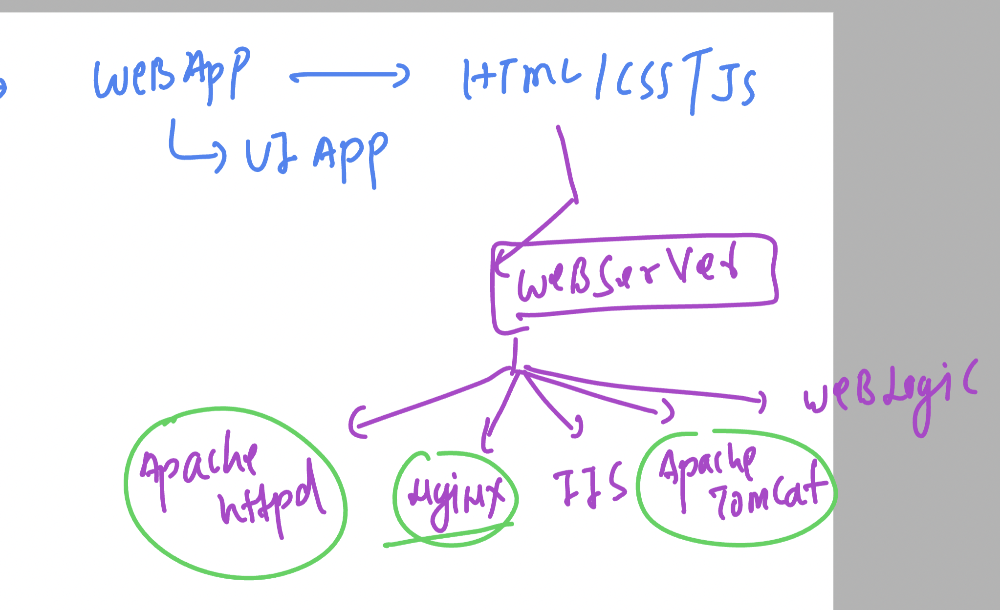

## Revision 


### introduction to web server 



### Intro to nginx 


## web app containerization using nginx 

### taking source code 

```
 git clone https://github.com/codingstella/vCard-personal-portfolio.git
```

### given content in current directory 

```
[ashu@docker-server ashu-ui-app]$ ls
docker-compose.yaml  Dockerfile  vCard-personal-portfolio
[ashu@docker-server ashu-ui-app]$ ls -a vCard-personal-portfolio/
.  ..  assets  .git  index.html  index.txt  README.md  website-demo-image
[ashu@docker-server ashu-ui-app]$ 

```

### dockerfile

```
FROM nginx 
LABEL name=ashutoshh
COPY vCard-personal-portfolio /usr/share/nginx/html/
```

### .dockerignore

```
vCard-personal-portfolio/.git
vCard-personal-portfolio/index.txt
vCard-personal-portfolio/README.md
```

### docker-compose.yaml 

```
version: '3.8'
services:
  ashu-ui-app:
    image: ashunginx:appv1
    build:
      context: .
      dockerfile: Dockerfile 
    container_name: ashuwebc1 
```

### let me run it 

```
ashu@docker-server ashu-ui-app]$ ls
docker-compose.yaml  Dockerfile  vCard-personal-portfolio
[ashu@docker-server ashu-ui-app]$ docker-compose  up -d
[+] Running 0/1
 ⠇ ashu-ui-app Pulling                                                                                                                              1.8s 
[+] Building 10.1s (7/7) FINISHED                                                                                                         docker:default
 => [ashu-ui-app internal] load build definition from Dockerfile                                                                                    0.0s
 => => transferring dockerfile: 181B                                                                                                                0.0s
 => [ashu-ui-app internal] load .dockerignore                                                                                                       0.0s
 => => transferring context: 198B                                                                                                                   0.0s
 => [ashu-ui-app internal] load metadata for docker.io/library/nginx:latest                                                                         2.3s
 => [ashu-ui-app internal] load build context                                                                                                       0.0s
 => => transferring context: 1.28MB                                                                                                                 0.0s
 => [ashu-ui-app 1/2] FROM docker.io/library/nginx@sha256:4c0fdaa8b6341bfdeca5f18f7837462c80cff90527ee35ef185571e1c327beac                          4.7s
 => => resolve docker.io/library/nginx@sha256:4c0fdaa8b6341bfdeca5f18f7837462c80cff90527ee35ef185571e1c327beac                                      0.0s
 => => sha256:523c417937604bc107d799e5cad1ae2ca8a9fd46306634fa2c547dc6220ec17c 1.99kB / 1.99kB                                                      0.0s
 => => sha256:4c0fdaa8b6341bfdeca5f18f7837462c80cff90527ee35ef185571e1c327beac 7.59kB / 7.59kB                                                      0.0s
 => => sha256:a5573528b1f0cf2f5d87c94fe0aee9d8967d5de98258be9303c3c6fa477824ec 29.16MB / 29.16MB                                                    1.5s
 => => sha256:8897d65c841707a2f02937de91c6644ba9699bd3ad194bdd84d2b61a93ca12f2 38.04MB / 38.04MB                                                    1.5s
 => => sha256:fbc138d1d206d59261b82b2c537e7819ca8f46c63ce80b4906394a8b83ea896a 627B / 627B                                                          0.5s
 => => sha256:6c7be49d2a11cfab9a87362ad27d447b45931e43dfa6919a8e1398ec09c1e353 7.02kB / 7.02kB                                                      0.0s
 => => sha256:06f386eb918297ce19936107ccb010187b2d6a95ba8bd60073610d371289b46c 955B / 955B                                                          0.7s
 => => sha256:aeb2f3db77c35ab11eccb3643b18e72e1085fcc42343078da8d72b76a6fd5b44 363B / 363B                                                          0.9s
 => => sha256:64fb762834ec1a0ca5d5980d4f810342d9fe5f1cf96b4d4bf2d4a27a564778ca 1.21kB / 1.21kB                                                      1.2s
 => => sha256:e5a7e61f6ff45ab19ba3bad8bfc4e38cdafbbca0cefcf1f81516bb14b6476557 1.40kB / 1.40kB                                                      1.5s
 => => extracting sha256:a5573528b1f0cf2f5d87c94fe0aee9d8967d5de98258be9303c3c6fa477824ec                                                           1.4s
 => => extracting sha256:8897d65c841707a2f02937de91c6644ba9699bd3ad194bdd84d2b61a93ca12f2                                                           1.3s
 => => extracting sha256:fbc138d1d206d59261b82b2c537e7819ca8f46c63ce80b4906394a8b83ea896a                                                           0.0s
 => => extracting sha256:06f386eb918297ce19936107ccb010187b2d6a95ba8bd60073610d371289b46c                                                           0.0s
 => => extracting sha256:aeb2f3db77c35ab11eccb3643b18e72e1085fcc42343078da8d72b76a6fd5b44                                                           0.0s
 => => extracting sha256:64fb762834ec1a0ca5d5980d4f810342d9fe5f1cf96b4d4bf2d4a27a564778ca                                                           0.0s
 => => extracting sha256:e5a7e61f6ff45ab19ba3bad8bfc4e38cdafbbca0cefcf1f81516bb14b6476557                                                           0.0s
 => [ashu-ui-app 2/2] COPY vCard-personal-portfolio /usr/share/nginx/html/                                                                          2.0s
 => [ashu-ui-app] exporting to image                                                                                                                1.0s
 => => exporting layers                                                                                                                             1.0s
 => => writing image sha256:9c752ac20c3c62a396e0674d1294b113253413e6db5dbbd767c5610ed1c852fa                                                        0.0s
 => => naming to docker.io/library/ashunginx:appv1                                                                                                  0.0s
[+] Running 1/2
 ⠴ Network ashu-ui-app_default  Created                                                                                                             0.5s 
 ✔ Container ashuwebc1          Started                            
```
