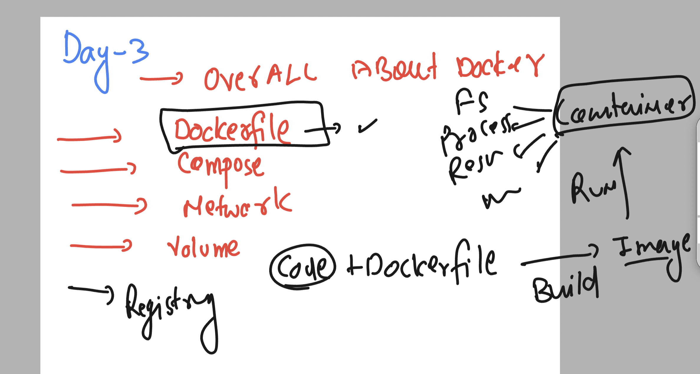
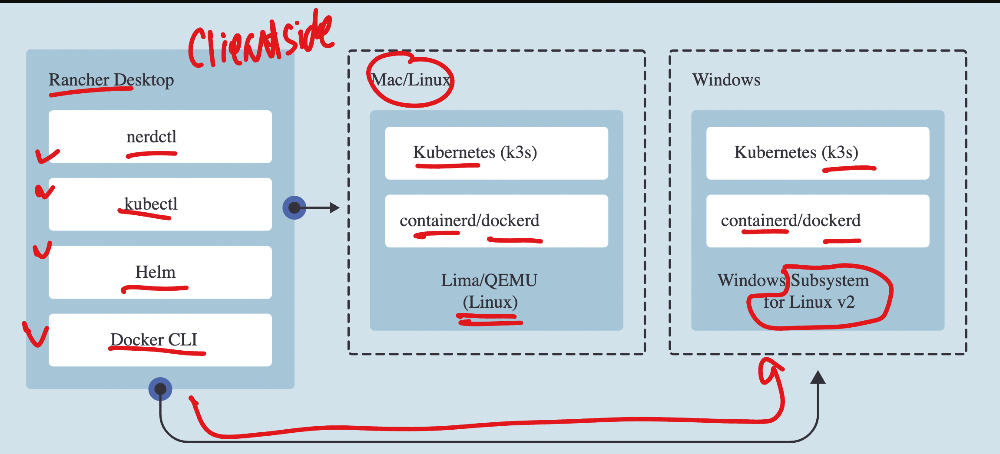
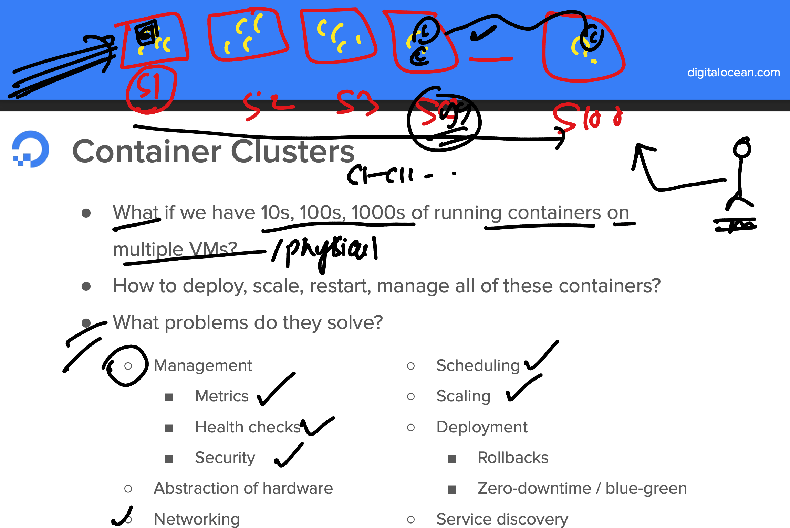
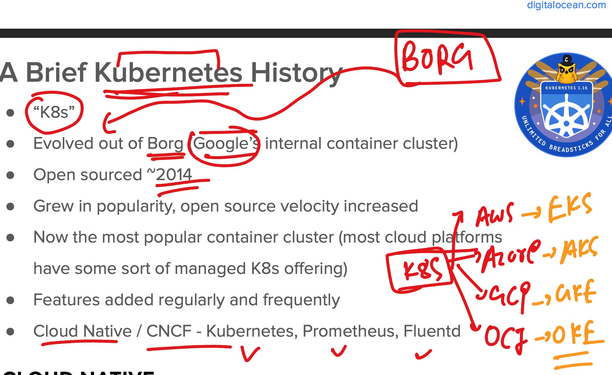
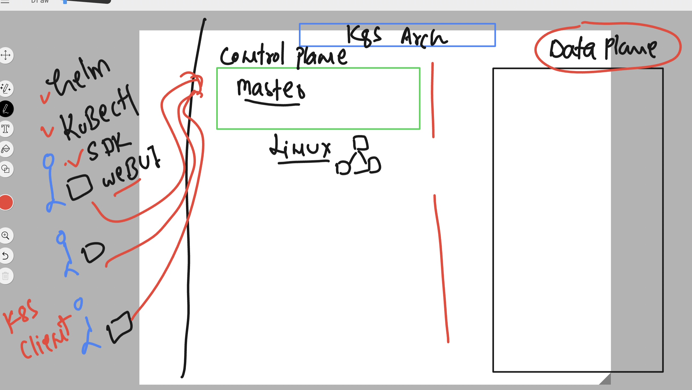
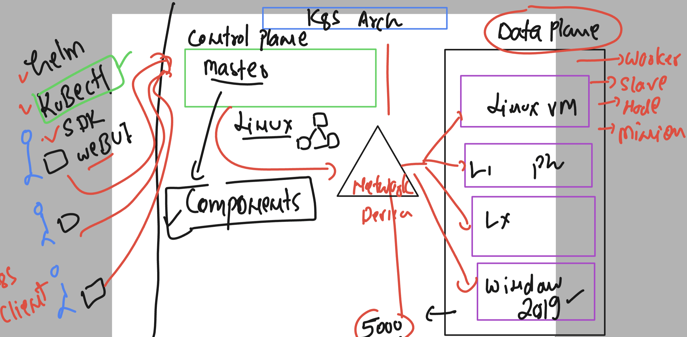
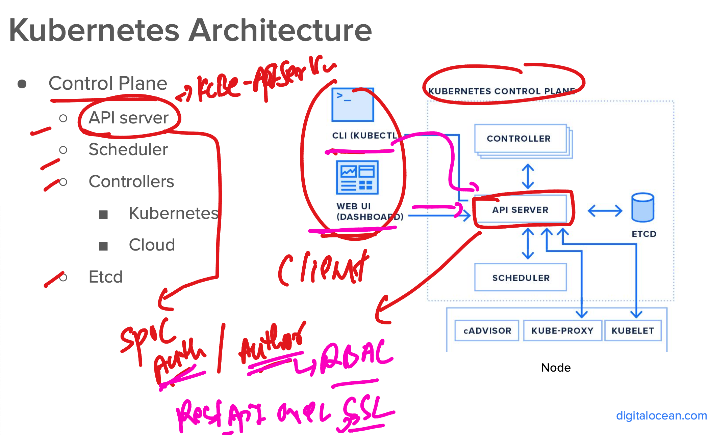
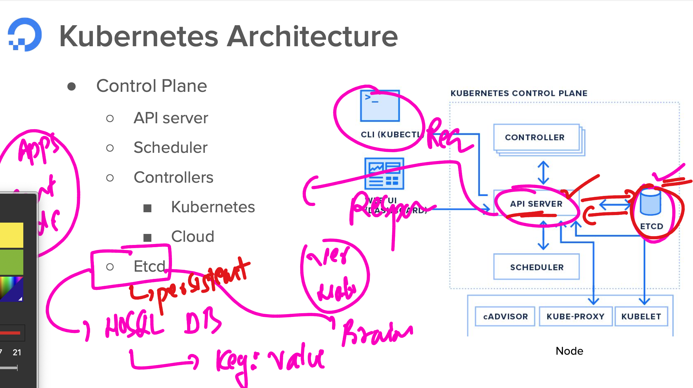
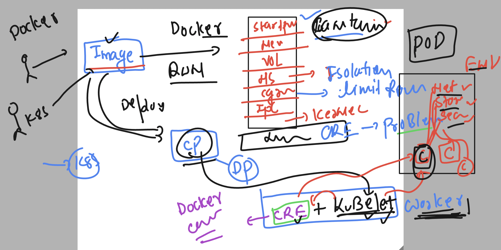
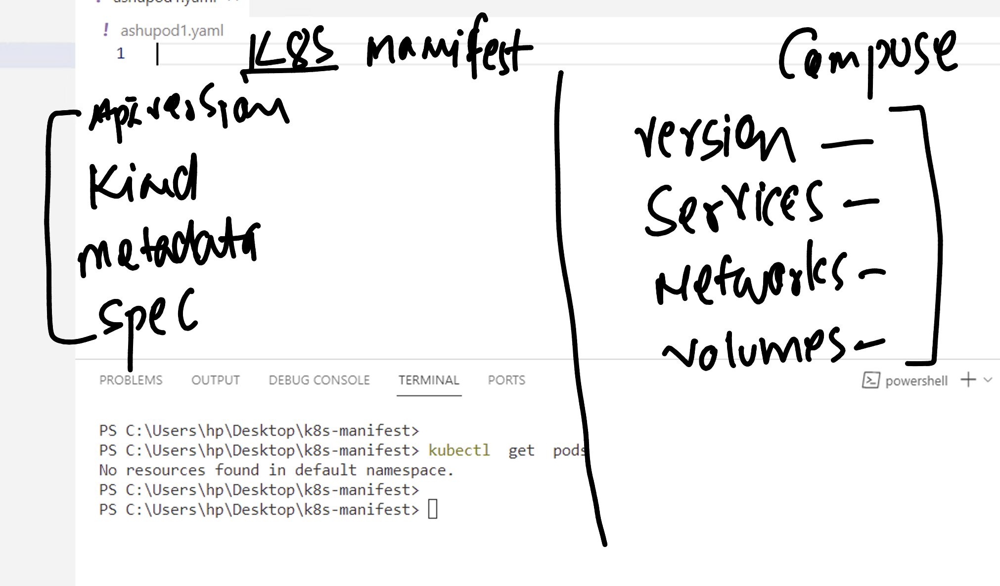

# oracle_containerK8s_29thjan2024

### Revision 



### Understanding rancher desktop offering 



### Problems with Container runtime engine 



### Introduction to container orchestration engine 


### More info aout k8s 



### k8s arch 1 



### k8s arch 2 



### k8s arch 3



### checking kubectl connection in case of rancher desktop 

```
PS C:\Users\hp> kubectl version  -o json
{
  "clientVersion": {
    "major": "1",
    "minor": "27",
    "gitVersion": "v1.27.1",
    "gitCommit": "4c9411232e10168d7b050c49a1b59f6df9d7ea4b",
    "gitTreeState": "clean",
    "buildDate": "2023-04-14T13:21:19Z",
    "goVersion": "go1.20.3",
    "compiler": "gc",
    "platform": "windows/amd64"
  },
  "kustomizeVersion": "v5.0.1",
  "serverVersion": {
    "major": "1",
    "minor": "26",
    "gitVersion": "v1.26.3+k3s1",
    "gitCommit": "01ea3ff27be0b04f945179171cec5a8e11a14f7b",
    "gitTreeState": "clean",
    "buildDate": "2023-03-27T22:23:17Z",
    "goVersion": "go1.19.7",
    "compiler": "gc",
    "platform": "linux/amd64"
  }
}
PS C:\Users\hp> kubectl version  -o yaml


```

### checking number of nodes 

```
PS C:\Users\hp> kubectl  get  nodes
NAME              STATUS   ROLES                  AGE    VERSION
desktop-52f5653   Ready    control-plane,master   287d   v1.26.3+k3s1
PS C:\Users\hp>

```

### api_server is getting info from ETcd 



## Deploy application in kuberntes

### Intro to pods 



### setup vscode to write pod manifest file  and checking pods 

```
PS C:\Users\hp\Desktop\k8s-manifest> kubectl get  nodes
NAME              STATUS   ROLES                  AGE    VERSION     
desktop-52f5653   Ready    control-plane,master   287d   v1.26.3+k3s1
PS C:\Users\hp\Desktop\k8s-manifest> 
PS C:\Users\hp\Desktop\k8s-manifest> 
PS C:\Users\hp\Desktop\k8s-manifest> kubectl  get  pods
No resources found in default namespace.
PS C:\Users\hp\Desktop\k8s-manifest> 

```


## compose vs k8s manifest 



### first Pod manifeset 

```
apiVersion: v1 # targeting k8s control plane APiversion on apiversion v1 
kind: Pod 
metadata: # info about kind 
  name: ashupod-1 
spec: # info about application 
  containers:
  - name: ashuc1 
    image: nginx  # image from docker hub 
    ports: # appllication port 
    - containerPort: 80 

```

### deploy it 

```
PS C:\Users\hp\Desktop\k8s-manifest> kubectl  create  -f  ashupod1.yaml
pod/ashupod-1 created
PS C:\Users\hp\Desktop\k8s-manifest> kubectl get  pods
NAME        READY   STATUS              RESTARTS   AGE
ashupod-1   0/1     ContainerCreating   0          35s
```

