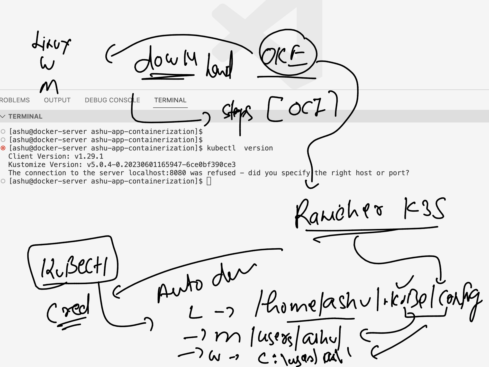
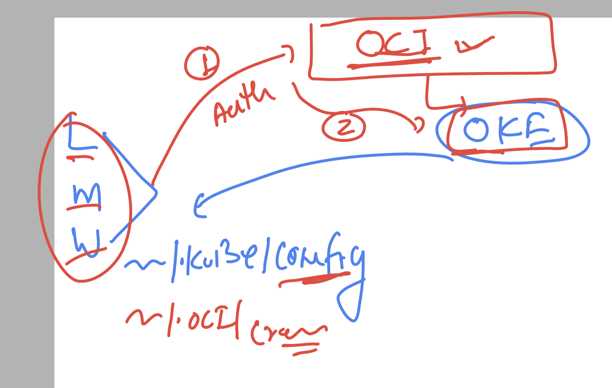
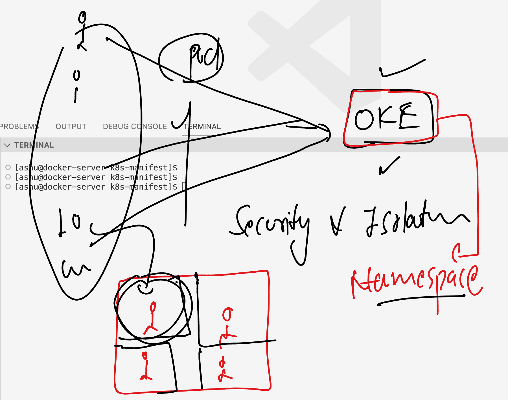
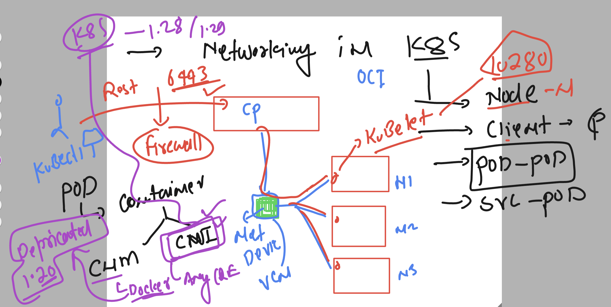
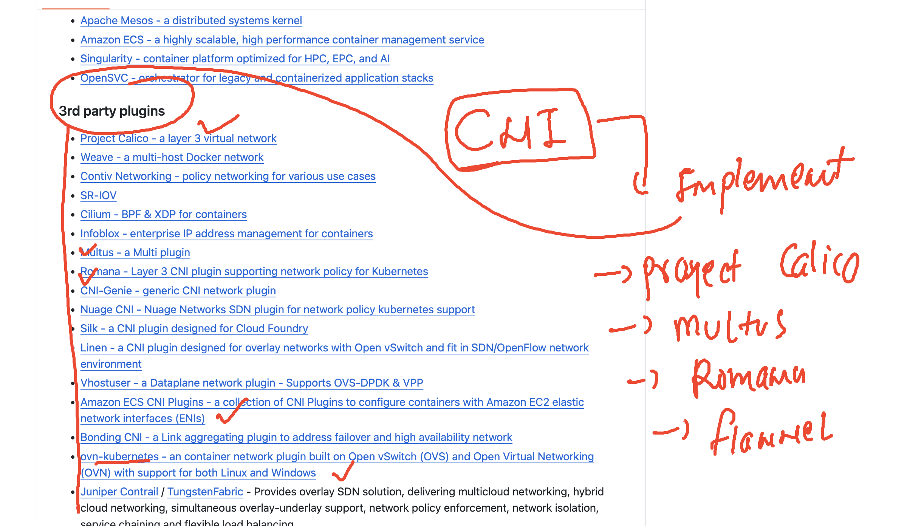
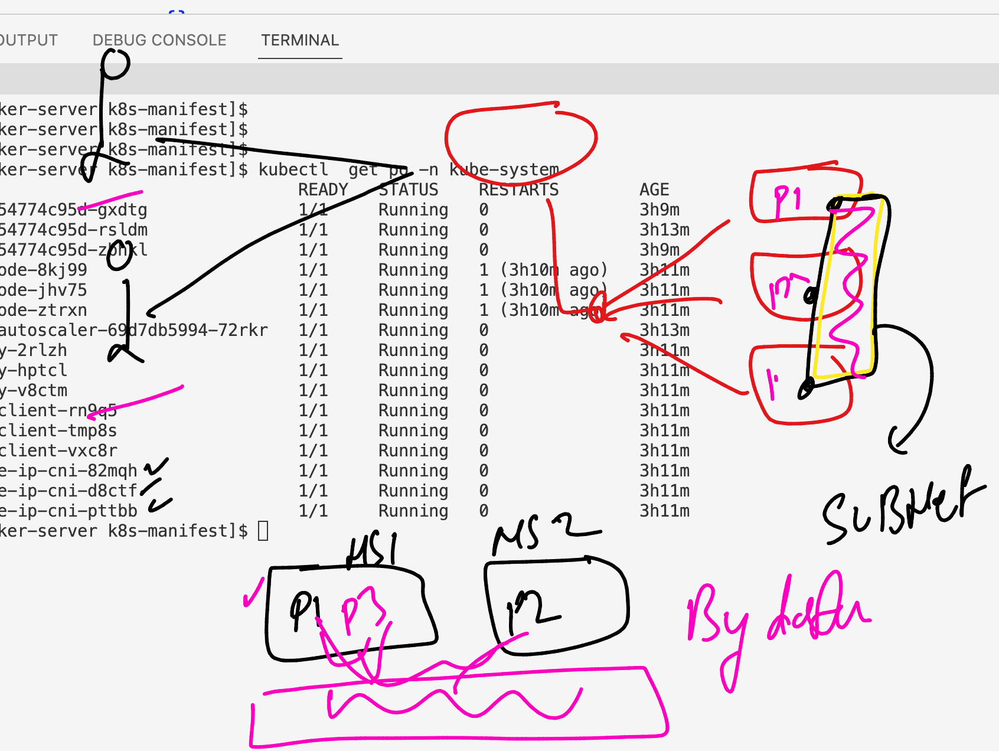

# oracle_containerK8s_29thjan2024

### Revision 


### Understanding rancher desktop offering 


### Problems with Container runtime engine 


### Introduction to container orchestration engine 


### More info aout k8s 


### k8s arch 1 


### k8s arch 2 


### k8s arch 3


### checking kubectl connection in case of rancher desktop 

```
PS C:\Users\hp> kubectl version  -o json
{
  "clientVersion": {
    "major": "1",
    "minor": "27",
    "gitVersion": "v1.27.1",
    "gitCommit": "4c9411232e10168d7b050c49a1b59f6df9d7ea4b",
    "gitTreeState": "clean",
    "buildDate": "2023-04-14T13:21:19Z",
    "goVersion": "go1.20.3",
    "compiler": "gc",
    "platform": "windows/amd64"
  },
  "kustomizeVersion": "v5.0.1",
  "serverVersion": {
    "major": "1",
    "minor": "26",
    "gitVersion": "v1.26.3+k3s1",
    "gitCommit": "01ea3ff27be0b04f945179171cec5a8e11a14f7b",
    "gitTreeState": "clean",
    "buildDate": "2023-03-27T22:23:17Z",
    "goVersion": "go1.19.7",
    "compiler": "gc",
    "platform": "linux/amd64"
  }
}
PS C:\Users\hp> kubectl version  -o yaml


```

### checking number of nodes 

```
PS C:\Users\hp> kubectl  get  nodes
NAME              STATUS   ROLES                  AGE    VERSION
desktop-52f5653   Ready    control-plane,master   287d   v1.26.3+k3s1
PS C:\Users\hp>

```

### api_server is getting info from ETcd 


## Deploy application in kuberntes

### Intro to pods 


### setup vscode to write pod manifest file  and checking pods 

```
PS C:\Users\hp\Desktop\k8s-manifest> kubectl get  nodes
NAME              STATUS   ROLES                  AGE    VERSION     
desktop-52f5653   Ready    control-plane,master   287d   v1.26.3+k3s1
PS C:\Users\hp\Desktop\k8s-manifest> 
PS C:\Users\hp\Desktop\k8s-manifest> 
PS C:\Users\hp\Desktop\k8s-manifest> kubectl  get  pods
No resources found in default namespace.
PS C:\Users\hp\Desktop\k8s-manifest> 

```


## compose vs k8s manifest 


### first Pod manifeset 

```
apiVersion: v1 # targeting k8s control plane APiversion on apiversion v1 
kind: Pod 
metadata: # info about kind 
  name: ashupod-1 
spec: # info about application 
  containers:
  - name: ashuc1 
    image: nginx  # image from docker hub 
    ports: # appllication port 
    - containerPort: 80 

```

### deploy it 

```
PS C:\Users\hp\Desktop\k8s-manifest> kubectl  create  -f  ashupod1.yaml
pod/ashupod-1 created
PS C:\Users\hp\Desktop\k8s-manifest> kubectl get  pods
NAME        READY   STATUS              RESTARTS   AGE
ashupod-1   0/1     ContainerCreating   0          35s
```

### chekcing more details about pod 

```
PS C:\Users\hp\Desktop\k8s-manifest> kubectl.exe  get  pods
NAME        READY   STATUS    RESTARTS   AGE  
ashupod-1   1/1     Running   0          2m37s
PS C:\Users\hp\Desktop\k8s-manifest> 
PS C:\Users\hp\Desktop\k8s-manifest> 
PS C:\Users\hp\Desktop\k8s-manifest> kubectl.exe  get  pods -o wide
NAME        READY   STATUS    RESTARTS   AGE     IP           NODE              NOMINATED NODE   READINESS GATES
ashupod-1   1/1     Running   0          2m42s   10.42.0.24   desktop-52f5653   <none>           <none>
PS C:\Users\hp\Desktop\k8s-manifest> kubectl.exe get nodes
NAME              STATUS   ROLES                  AGE    VERSION     
desktop-52f5653   Ready    control-plane,master   287d   v1.26.3+k3s1
PS C:\Users\hp\Desktop\k8s-manifest> 


```

### more pod specific commands

```
PS C:\Users\hp\Desktop\k8s-manifest> kubectl get  pods             
NAME        READY   STATUS    RESTARTS   AGE
ashupod-1   1/1     Running   0          14m
PS C:\Users\hp\Desktop\k8s-manifest> 
PS C:\Users\hp\Desktop\k8s-manifest> kubectl get  pods -o wide
NAME        READY   STATUS    RESTARTS   AGE   IP           NODE              NOMINATED NODE   READINESS GATES
ashupod-1   1/1     Running   0          14m   10.42.0.24   desktop-52f5653   <none>           <none>
PS C:\Users\hp\Desktop\k8s-manifest> 
PS C:\Users\hp\Desktop\k8s-manifest> kubectl.exe  describe pod ashupod-1 
Name:             ashupod-1
Namespace:        default
Priority:         0
Service Account:  default
Node:             desktop-52f5653/172.24.73.34
Start Time:       Tue, 30 Jan 2024 22:40:27 -0800
Labels:           <none>
Annotations:      <none>
Status:           Running
IP:               10.42.0.24
IPs:
  IP:  10.42.0.24
Containers:
  ashuc1:
    Container ID:   docker://3e69aaacb611f50bf6d8cb9629c1f1e9eebb625d710b2e0de1fbde3ed3af92c8
    Image:          nginx
    Image ID:       docker-pullable://nginx@sha256:4c0fdaa8b6341bfdeca5f18f7837462c80cff90527ee35ef185571e1c327beac
    Port:           80/TCP
    Host Port:      0/TCP
    State:          Running
      Started:      Tue, 30 Jan 2024 22:41:21 -0800
    Ready:          True
    Restart Count:  0
    Environment:    <none>
    Mounts:
      /var/run/secrets/kubernetes.io/serviceaccount from kube-api-access-w824v (ro)
Conditions:
  Type              Status
  Initialized       True
  Ready             True
  ContainersReady   True
  PodScheduled      True
Volumes:
  kube-api-access-w824v:
    Type:                    Projected (a volume that contains injected data from multiple sources)
    TokenExpirationSeconds:  3607
    ConfigMapName:           kube-root-ca.crt
    ConfigMapOptional:       <nil>
    DownwardAPI:             true
QoS Class:                   BestEffort
Node-Selectors:              <none>
Tolerations:                 node.kubernetes.io/not-ready:NoExecute op=Exists for 300s
                             node.kubernetes.io/unreachable:NoExecute op=Exists for 300s
Events:
  Type    Reason     Age   From               Message
  ----    ------     ----  ----               -------
  Normal  Scheduled  14m   default-scheduler  Successfully assigned default/ashupod-1 to desktop-52f5653
  Normal  Pulling    14m   kubelet            Pulling image "nginx"
  Normal  Pulled     14m   kubelet            Successfully pulled image "nginx" in 48.2486111s (48.2487231s including waiting)
  Normal  Created    14m   kubelet            Created container ashuc1
  Normal  Started    14m   kubelet            Started container ashuc1
```

### checking logs of pod 

```
PS C:\Users\hp\Desktop\k8s-manifest> kubectl logs ashupod-1 
/docker-entrypoint.sh: /docker-entrypoint.d/ is not empty, will attempt to perform configuration
/docker-entrypoint.sh: Looking for shell scripts in /docker-entrypoint.d/
/docker-entrypoint.sh: Launching /docker-entrypoint.d/10-listen-on-ipv6-by-default.sh
10-listen-on-ipv6-by-default.sh: info: Getting the checksum of /etc/nginx/conf.d/default.conf  
10-listen-on-ipv6-by-default.sh: info: Enabled listen on IPv6 in /etc/nginx/conf.d/default.conf
/docker-entrypoint.sh: Sourcing /docker-entrypoint.d/15-local-resolvers.envsh
/docker-entrypoint.sh: Launching /docker-entrypoint.d/20-envsubst-on-templates.sh
/docker-entrypoint.sh: Launching /docker-entrypoint.d/30-tune-worker-processes.sh
/docker-entrypoint.sh: Configuration complete; ready for start up
2024/01/31 06:41:21 [notice] 1#1: using the "epoll" event method
2024/01/31 06:41:21 [notice] 1#1: nginx/1.25.3
2024/01/31 06:41:21 [notice] 1#1: built by gcc 12.2.0 (Debian 12.2.0-14)
2024/01/31 06:41:21 [notice] 1#1: OS: Linux 5.10.16.3-microsoft-standard-WSL2
```

### access container inside pod 

```
PS C:\Users\hp\Desktop\k8s-manifest> kubectl get po 
NAME        READY   STATUS    RESTARTS   AGE
ashupod-1   1/1     Running   0          17m
PS C:\Users\hp\Desktop\k8s-manifest> 
PS C:\Users\hp\Desktop\k8s-manifest> kubectl exec -it ashupod-1 -- bash 
root@ashupod-1:/#
root@ashupod-1:/# 
root@ashupod-1:/# 
root@ashupod-1:/# id
uid=0(root) gid=0(root) groups=0(root)
root@ashupod-1:/# ls
bin   dev                  docker-entrypoint.sh  home  lib32  libx32  mnt  proc  run   srv  tmp  var
boot  docker-entrypoint.d  etc                   lib   lib64  media   opt  root  sbin  sys  usr     
root@ashupod-1:/# exit
exit
PS C:\Users\hp\Desktop\k8s-manifest> 
```

### deleting pod

```
PS C:\Users\hp\Desktop\k8s-manifest> kubectl  delete pod  ashupod-1
pod "ashupod-1" deleted
```

### default llocation from where kubectl read k8s cred 



### demo in windows 

```
sers\hp>
PS C:\Users\hp> kubectl get nodes
NAME              STATUS   ROLES                  AGE    VERSION
desktop-52f5653   Ready    control-plane,master   287d   v1.26.3+k3s1
PS C:\Users\hp>
PS C:\Users\hp>
PS C:\Users\hp> cd .kube
PS C:\Users\hp\.kube> ls


    Directory: C:\Users\hp\.kube


Mode                 LastWriteTime         Length Name
----                 -------------         ------ ----
d-----          6/9/2023   6:14 AM                cache
-a----         1/30/2024   8:26 PM           8721 config


PS C:\Users\hp\.kube>
```

### mac users 

```
 ~ cd  ~/.kube
➜  .kube ls
cache  config
➜  .kube cat config 
apiVersion: v1
clusters:

```

### connecting to OKE 



### in linux vm configure OKE cred 

```
[ashu@docker-server ashu-app-containerization]$ mkdir  ~/.kube 
[ashu@docker-server ashu-app-containerization]$ mkdir  ~/.oci
[ashu@docker-server ashu-app-containerization]$ cp -v  /tmp/config  ~/.kube/
‘/tmp/config’ -> ‘/home/ashu/.kube/config’
[ashu@docker-server ashu-app-containerization]$ ls -l ~/.kube/
total 4
-rw-r--r--. 1 ashu ashu 2370 Jan 31 09:01 config
[ashu@docker-server ashu-app-containerization]$ 


### Downlaod oci detaisl

 cp -v /tmp/.oci/*   ~/.oci/

chmod  600 ~/.oci/config
 chmod  600 ~/.oci/oci_api_key.pem 
```
### checking kubectl to get nodes

```
kubectl  get nodes
NAME          STATUS   ROLES   AGE   VERSION
10.0.10.192   Ready    node    53m   v1.28.2
10.0.10.20    Ready    node    53m   v1.28.2
10.0.10.238   Ready    node    53m   v1.28.2
[ashu@docker-server ashu-app-containerization]$ 
```

### Creating multi container pod 

```
apiVersion: v1
kind: Pod
metadata:
  name: ashupod1 
spec:
  containers:
  - name: ashuc2 
    image: alpine 
    command: ["ping","fb.com"]
  - name: ashuc11
    image: nginx 
    ports:
    - containerPort: 80 
```

### 

```
[ashu@docker-server ashu-app-containerization]$ ls
ashu-db-app  ashu-env  ashu-java  ashu-python  ashu-ui-app  k8s-manifest  tasks_ashu
[ashu@docker-server ashu-app-containerization]$ cd  k8s-manifest/
[ashu@docker-server k8s-manifest]$ ls
ashupod1.yaml
[ashu@docker-server k8s-manifest]$ kubectl  create -f ashupod1.yaml 
pod/ashupod1 created
[ashu@docker-server k8s-manifest]$ kubectl  get  pods
NAME         READY   STATUS              RESTARTS   AGE
anantpod-1   0/2     ContainerCreating   0          1s
ashupod1     0/2     ContainerCreating   0          13s
[ashu@docker-server k8s-manifest]$ kubectl  get  pods
NAME         READY   STATUS              RESTARTS   AGE
anantpod-1   0/2     ContainerCreating   0          14s
ashupod1     2/2     Running             0          26s
[ashu@docker-server k8s-manifest]$ 

```

### accessing containers in multi container pod case 

```
ashu@docker-server k8s-manifest]$ kubectl  exec -it  ashupod1 -- sh 
Defaulted container "ashuc2" out of: ashuc2, ashuc11
/ # 
/ # 
/ # id
uid=0(root) gid=0(root) groups=0(root),1(bin),2(daemon),3(sys),4(adm),6(disk),10(wheel),11(floppy),20(dialout),26(tape),27(video)
/ # exit
[ashu@docker-server k8s-manifest]$ 
[ashu@docker-server k8s-manifest]$ kubectl  exec -it  ashupod1 -c ashuc11 -- bash  
root@ashupod1:/# ls
bin   dev                  docker-entrypoint.sh  home  lib32  libx32  mnt  proc  run   srv  tmp  var
boot  docker-entrypoint.d  etc                   lib   lib64  media   opt  root  sbin  sys  usr
root@ashupod1:/# exit
exit
```


### autogenerate kubectl based manifest

```
[ashu@docker-server k8s-manifest]$ kubectl  run  ashupod2 --image=nginx  --port 80 --dry-run=client 
pod/ashupod2 created (dry run)
[ashu@docker-server k8s-manifest]$ kubectl  run  ashupod2 --image=nginx  --port 80 --dry-run=client  -o yaml 
apiVersion: v1
kind: Pod
metadata:
  creationTimestamp: null
  labels:
    run: ashupod2
  name: ashupod2
spec:
  containers:
  - image: nginx
    name: ashupod2
    ports:
    - containerPort: 80
    resources: {}
  dnsPolicy: ClusterFirst
  restartPolicy: Always
status: {}
[ashu@docker-server k8s-manifest]$ kubectl  run  ashupod2 --image=nginx  --port 80 --dry-run=client  -o json 
{
    "kind": "Pod",
    "apiVersion": "v1",
    "metadata": {
        "name": "ashupod2",
        "creationTimestamp": null,
        "labels": {
            "run": "ashupod2"
        }
    },
    "spec": {
        "containers": [
            {
                "name": "ashupod2",
                "image": "nginx",
                "ports": [
                    {
                        "containerPort": 80
                    }
                ],
                "resources": {}
            }
        ],
        "restartPolicy": "Always",
        "dnsPolicy": "ClusterFirst"
```

### 

```
171  kubectl  get pods
  172  kubectl  run  ashupod2 --image=nginx  --port 80 --dry-run=client 
  173  kubectl  run  ashupod2 --image=nginx  --port 80 --dry-run=client  -o yaml 
  174  kubectl  run  ashupod2 --image=nginx  --port 80 --dry-run=client  -o json 
  175  history 
[ashu@docker-server k8s-manifest]$ 
[ashu@docker-server k8s-manifest]$ 
[ashu@docker-server k8s-manifest]$ kubectl  run  ashupod2 --image=nginx  --port 80 --dry-run=client  -o json >auto.json
[ashu@docker-server k8s-manifest]$ 
[ashu@docker-server k8s-manifest]$ kubectl  run  ashupod2 --image=nginx  --port 80 --dry-run=client  -o yaml >new.yaml
[ashu@docker-server k8s-manifest]$ 
[ashu@docker-server k8s-manifest]$ 
[ashu@docker-server k8s-manifest]$ kubectl  create -f auto.json 
pod/ashupod2 created
[ashu@docker-server k8s-manifest]$ 
[ashu@docker-server k8s-manifest]$ kubectl  get pods
NAME       READY   STATUS    RESTARTS   AGE
ashupod2   1/1     Running   0          8s
[ashu@docker-server k8s-manifest]$ kubectl  delete -f auto.json 
pod "ashupod2" deleted
```

### namespaces in k8s 



### there are 4 namesapces in k8s

```
[ashu@docker-server k8s-manifest]$ kubectl  get  namespaces
NAME              STATUS   AGE
default           Active   83m
kube-node-lease   Active   83m
kube-public       Active   83m
kube-system       Active   83m
[ashu@docker-server k8s-manifest]$ 
```

### Creating namespaces 

```
[ashu@docker-server k8s-manifest]$ kubectl  create  namespace  ashu-project  --dry-run=client -o yaml
apiVersion: v1
kind: Namespace
metadata:
  creationTimestamp: null
  name: ashu-project
spec: {}
status: {}
[ashu@docker-server k8s-manifest]$ kubectl  create  namespace  ashu-project 
namespace/ashu-project created
[ashu@docker-server k8s-manifest]$ 
[ashu@docker-server k8s-manifest]$ kubectl  get namespaces
NAME              STATUS   AGE
ashu-project      Active   8s
default           Active   86m
kube-node-lease   Active   86m
kube-public       Active   86m
```

### changing default namespace for my self

```
[ashu@docker-server k8s-manifest]$ kubectl config set-context --current --namespace ashu-project
Context "context-c2qihrdomna" modified.
[ashu@docker-server k8s-manifest]$ 
[ashu@docker-server k8s-manifest]$ kubectl  get  pods
No resources found in ashu-project namespace.
```

### checking default namespace

```

[ashu@docker-server k8s-manifest]$ kubectl  config get-contexts
CURRENT   NAME                  CLUSTER               AUTHINFO           NAMESPACE
*         context-c2qihrdomna   cluster-c2qihrdomna   user-c2qihrdomna   ashu-project
[ashu@docker-server k8s-manifest]$ 
```

### OKE -- AMD processor based images 

```
[ashu@docker-server k8s-manifest]$ kubectl  run ashufinal --image=ap-mumbai-1.ocir.io/bmfqoyqvmham/trainingapp:nginxamd
pod/ashufinal created
[ashu@docker-server k8s-manifest]$ kubectl  get pod
NAME        READY   STATUS    RESTARTS   AGE
ashufinal   1/1     Running   0          8s
[ashu@docker-server k8s-manifest]$ kubectl  run client --image=ap-mumbai-1.ocir.io/bmfqoyqvmham/trainingapp:alpineamd --command sleep 40000
pod/client created
[ashu@docker-server k8s-manifest]$ kubectl  get pods
NAME        READY   STATUS    RESTARTS   AGE
ashufinal   1/1     Running   0          2m46s
client      1/1     Running   0          8s
[ashu@docker-server k8s-manifest]$ 
```

### CNI - -COntainer network interface model 



### CNI options in k8s pod netowrking 



### ALL the pod in k8s cluster even from diff namespaces they can connect to each other 



### testing

```
[ashu@docker-server k8s-manifest]$ kubectl  get  po -o wide
NAME        READY   STATUS    RESTARTS   AGE   IP           NODE         NOMINATED NODE   READINESS GATES
ashufinal   1/1     Running   0          47m   10.0.10.29   10.0.10.20   <none>           <none>
client      1/1     Running   0          45m   10.0.10.8    10.0.10.20   <none>           <none>
[ashu@docker-server k8s-manifest]$ 
[ashu@docker-server k8s-manifest]$ 
[ashu@docker-server k8s-manifest]$ 
[ashu@docker-server k8s-manifest]$ kubectl  exec -it client -- sh 


/ # 
/ # 
/ # curl http://10.0.10.29
sh: curl: not found
/ # apk add curl 
fetch https://dl-cdn.alpinelinux.org/alpine/v3.19/main/x86_64/APKINDEX.tar.gz
fetch https://dl-cdn.alpinelinux.org/alpine/v3.19/community/x86_64/APKINDEX.tar.gz
(1/8) Installing ca-certificates (20230506-r0)
(2/8) Installing brotli-libs (1.1.0-r1)
(3/8) Installing c-ares (1.24.0-r1)
(4/8) Installing libunistring (1.1-r2)
(5/8) Installing libidn2 (2.3.4-r4)
(6/8) Installing nghttp2-libs (1.58.0-r0)
(7/8) Installing libcurl (8.5.0-r0)
(8/8) Installing curl (8.5.0-r0)
Executing busybox-1.36.1-r15.trigger
Executing ca-certificates-20230506-r0.trigger
OK: 12 MiB in 23 packages
/ # 
/ # 
/ # curl http://10.0.10.29
<!DOCTYPE HTML>
<!--
        Phantom by HTML5 UP
```


