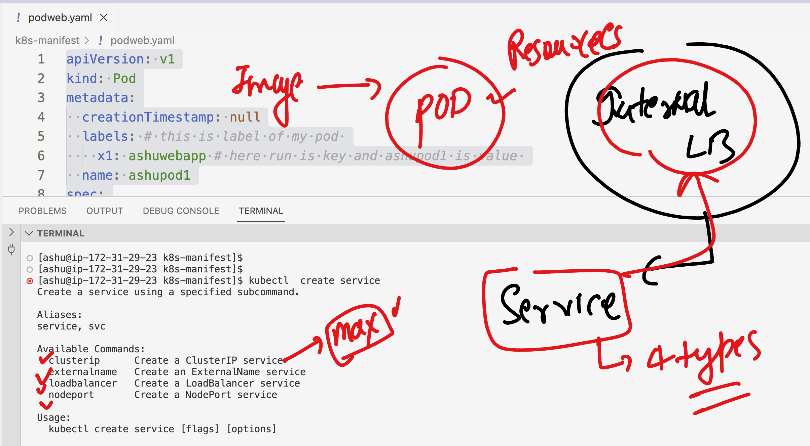
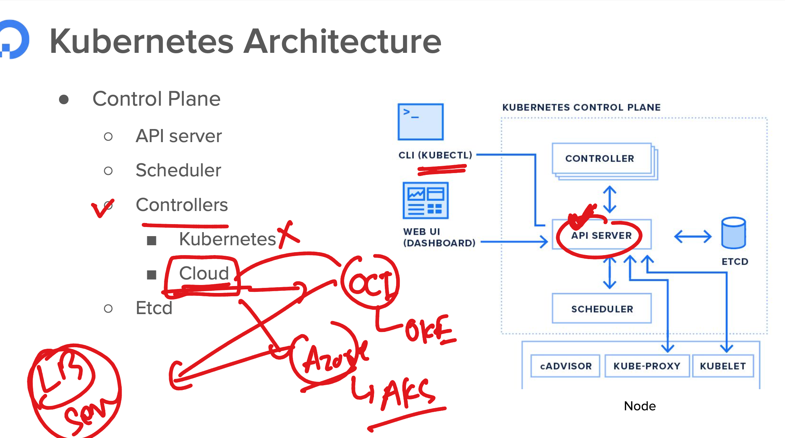
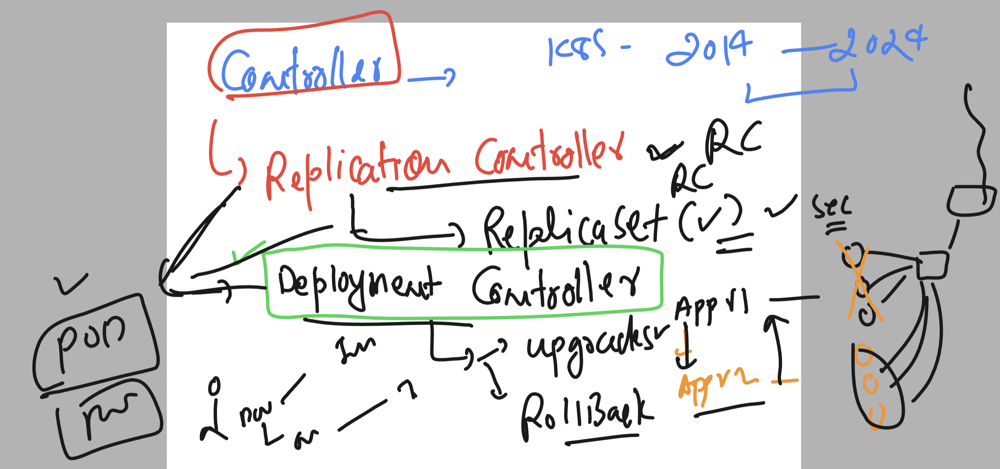
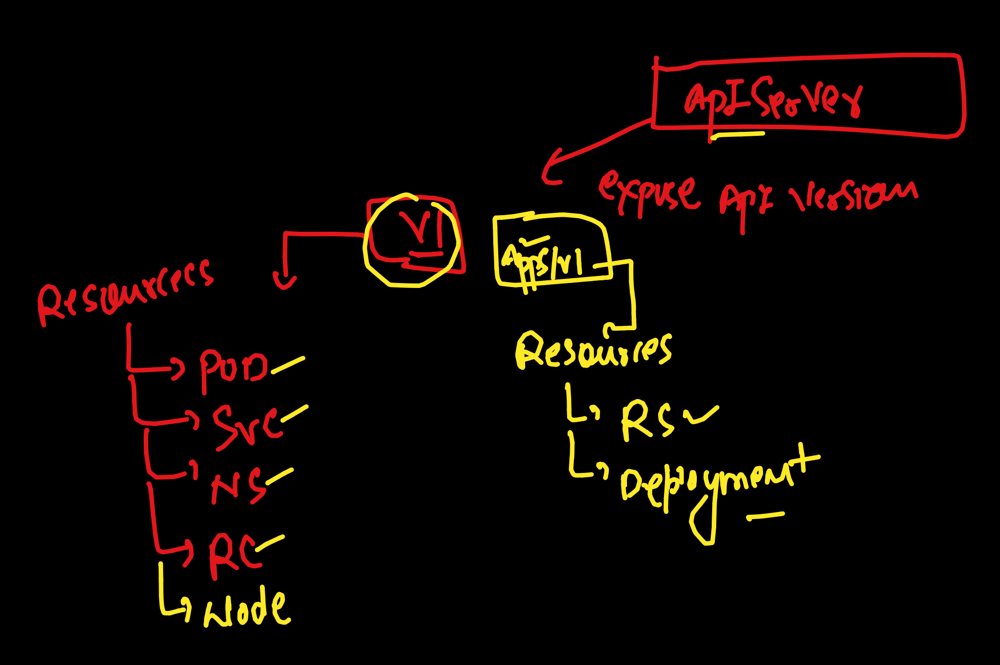

### revision 


### Understanding docker image build cpu depedencies 


### Creating ns and configure it 

```
[ashu@ip-172-31-29-23 ashu-work]$ kubectl  create  ns  ashu-apps
namespace/ashu-apps created
[ashu@ip-172-31-29-23 ashu-work]$ kubectl config set-context --current --namespace  ashu-apps
Context "oracle_training" modified.
[ashu@ip-172-31-29-23 ashu-work]$ 
[ashu@ip-172-31-29-23 ashu-work]$ 
[ashu@ip-172-31-29-23 ashu-work]$ kubectl config get-contexts 
CURRENT   NAME              CLUSTER           AUTHINFO                            NAMESPACE
*         oracle_training   oracle_training   clusterUser_k8sty_oracle_training   ashu-apps
[ashu@ip-172-31-29-23 ashu-work]$ 
[ashu@ip-172-31-29-23 ashu-work]$ kubectl  get pods
No resources found in ashu-apps namespace.
[ashu@ip-172-31-29-23 ashu-work]$ 

```
### verify 

```
ashu@ip-172-31-29-23 ashu-work]$ docker version 
Client:
 Version:           20.10.25
 API version:       1.41
 Go version:        go1.20.12
 Git commit:        b82b9f3
 Built:             Fri Dec 29 20:37:18 2023
 OS/Arch:           linux/amd64
 Context:           default
 Experimental:      true

Server:
 Engine:
  Version:          20.10.25
  API version:      1.41 (minimum version 1.12)
  Go version:       go1.20.12
  Git commit:       5df983c
  Built:            Fri Dec 29 20:38:05 2023
  OS/Arch:          linux/amd64
  Experimental:     false
 containerd:
  Version:          1.7.2
  GitCommit:        0cae528dd6cb557f7201036e9f43420650207b58
 runc:
  Version:          1.1.11
  GitCommit:        4bccb38cc9cf198d52bebf2b3a90cd14e7af8c06
 docker-init:
  Version:          0.19.0
  GitCommit:        de40ad0
[ashu@ip-172-31-29-23 ashu-work]$ kubectl  config get-contexts 
CURRENT   NAME              CLUSTER           AUTHINFO                            NAMESPACE
*         oracle_training   oracle_training   clusterUser_k8sty_oracle_training   ashu-apps
[ashu@ip-172-31-29-23 ashu-work]$ 
```

### fresh image build compatible to multiple cpu family

```
ashu@ip-172-31-29-23 ashu-work]$ ls
docker-images  k8s-manifest
[ashu@ip-172-31-29-23 ashu-work]$ cd  docker-images/
[ashu@ip-172-31-29-23 docker-images]$ ls
[ashu@ip-172-31-29-23 docker-images]$ git clone https://github.com/schoolofdevops/html-sample-app.git
Cloning into 'html-sample-app'...
remote: Enumerating objects: 74, done.
remote: Counting objects: 100% (74/74), done.
remote: Compressing objects: 100% (69/69), done.
remote: Total 74 (delta 5), reused 71 (delta 5), pack-reused 0
Receiving objects: 100% (74/74), 1.38 MiB | 24.80 MiB/s, done.
Resolving deltas: 100% (5/5), done.
[ashu@ip-172-31-29-23 docker-images]$ ls
html-sample-app
[ashu@ip-172-31-29-23 docker-images]$ ls
Dockerfile  html-sample-app
[ashu@ip-172-31-29-23 docker-images]$ 
```

### Dockerfile 

```
FROM nginx 
LABEL name="ashutoshh"
COPY html-sample-app /usr/share/nginx/html/
```

### build and push 

```
[ashu@ip-172-31-29-23 docker-images]$ ls
Dockerfile  html-sample-app
[ashu@ip-172-31-29-23 docker-images]$ docker build -t  dockerashu/ashu-oraclewebapp:linuxamdv1 . 
Sending build context to Docker daemon  3.629MB
Step 1/3 : FROM nginx
latest: Pulling from library/nginx
2f44b7a888fa: Pull complete 
8b7dd3ed1dc3: Pull complete 
35497dd96569: Pull complete 
36664b6ce66b: Pull complete 
2d455521f76c: Pull complete 
dc9c4fdb83d6: Pull complete 
8056d2bcf3b6: Pull complete 
Digest: sha256:4c0fdaa8b6341bfdeca5f18f7837462c80cff90527ee35ef185571e1c327beac
Status: Downloaded newer image for nginx:latest
 ---> a8758716bb6a
Step 2/3 : LABEL name="ashutoshh"
 ---> Running in 79198fe0a255
Removing intermediate container 79198fe0a255
 ---> 066df059746e
Step 3/3 : COPY html-sample-app /usr/share/nginx/html/
 ---> d7b4943e938b
Successfully built d7b4943e938b
Successfully tagged dockerashu/ashu-oraclewebapp:linuxamdv1
[ashu@ip-172-31-29-23 docker-images]$ docker login 
Login with your Docker ID to push and pull images from Docker Hub. If you don't have a Docker ID, head over to https://hub.docker.com to create one.
Username: dockerashu
Password: 
WARNING! Your password will be stored unencrypted in /home/ashu/.docker/config.json.
Configure a credential helper to remove this warning. See
https://docs.docker.com/engine/reference/commandline/login/#credentials-store

Login Succeeded
[ashu@ip-172-31-29-23 docker-images]$ docker push dockerashu/ashu-oraclewebapp:linuxamdv1
The push refers to repository [docker.io/dockerashu/ashu-oraclewebapp]
1c4510ca6411: Pushed 
009507b85609: Mounted from library/nginx 
fbcc9bc44d3e: Mounted from library/nginx 
b4ad47845036: Mounted from library/nginx 
eddcd06e5ef9: Mounted from library/nginx 
b61d4b2cd2da: Mounted from library/nginx 
b6c2a8d6f0ac: Mounted from library/nginx 
571ade696b26: Mounted from library/nginx 
```

### best way to build image as per industry standard 

### dockerfile 

```
ARG arch 
# use of arg to accept values in variable during build time 
FROM  --platform=${arch}  nginx
LABEL name="ashutoshh"
COPY html-sample-app /usr/share/nginx/html/
```

### build command 

```
docker build -t  dockerashu/ashu-oraclewebapp:appv2  --build-arg arch=arm64 --no-cache .
```

### Deploying pod from docker hub amd based image

```
ashu@ip-172-31-29-23 docker-images]$ cd ../k8s-manifest/
[ashu@ip-172-31-29-23 k8s-manifest]$ ls
[ashu@ip-172-31-29-23 k8s-manifest]$ kubectl run ashupod1 --image=dockerashu/ashu-oraclewebapp:linuxamdv1 --port 80 --dry-run=client  -o yaml >podweb.yaml 
[ashu@ip-172-31-29-23 k8s-manifest]$ kubectl create -f podweb.yaml 
pod/ashupod1 created
[ashu@ip-172-31-29-23 k8s-manifest]$ kubectl  get  pods
NAME       READY   STATUS    RESTARTS   AGE
ashupod1   1/1     Running   0          8s
[ashu@ip-172-31-29-23 k8s-manifest]$ 

```


### CNi network traffic distribution 


### internal Loadbalancer will be using service discovery to find all the pods of same app


### internal LB will be finding relevent pod ip using label concept 


### incase to change label of pod 

```
apiVersion: v1
kind: Pod
metadata:
  creationTimestamp: null
  labels: # this is label of my pod 
    x1: ashuwebapp # here run is key and ashupod1 is value 
  name: ashupod1
spec:
  containers:
  - image: dockerashu/ashu-oraclewebapp:linuxamdv1
    name: ashupod1
    ports:
    - containerPort: 80
    resources: {}
  dnsPolicy: ClusterFirst
  restartPolicy: Always
status: {}

```

### replacing pod 

```
ashu@ip-172-31-29-23 k8s-manifest]$ kubectl  replace -f podweb.yaml  --force
pod "ashupod1" deleted
pod/ashupod1 replaced
[ashu@ip-172-31-29-23 k8s-manifest]$ kubectl  get po 
NAME       READY   STATUS    RESTARTS   AGE
ashupod1   1/1     Running   0          9s
[ashu@ip-172-31-29-23 k8s-manifest]$ kubectl  get po  --show-labels
NAME       READY   STATUS    RESTARTS   AGE   LABELS
ashupod1   1/1     Running   0          17s   x1=ashuwebapp
[ashu@ip-172-31-29-23 k8s-manifest]$ 
```

### Creating internal LB using service Resource type 



### ClusterIP type service Create 

```
kubectl  create  service   clusterip   ashulb1  --tcp  1234:80  --dry-run=client -o yaml >clustersvc.yaml 
```

### modify service yaml 

```
apiVersion: v1
kind: Service
metadata:
  creationTimestamp: null
  labels:
    app: ashulb1
  name: ashulb1 # name of internal LB 
spec:
  ports:
  - name: 1234-80
    port: 1234
    protocol: TCP
    targetPort: 80
  selector: # they way internal will be finding pod IP in svc discovery DB 
    #app: ashulb1
    x1: ashuwebapp # label of pods 
  type: ClusterIP # type of service 
status:
  loadBalancer: {}

```

### send create request to apiserver

```
[ashu@ip-172-31-29-23 k8s-manifest]$ 
[ashu@ip-172-31-29-23 k8s-manifest]$ kubectl create -f clustersvc.yaml 
service/ashulb1 created
[ashu@ip-172-31-29-23 k8s-manifest]$ kubectl  get  service 
NAME      TYPE        CLUSTER-IP     EXTERNAL-IP   PORT(S)    AGE
ashulb1   ClusterIP   10.0.198.148   <none>        1234/TCP   5s
[ashu@ip-172-31-29-23 k8s-manifest]$


[ashu@ip-172-31-29-23 k8s-manifest]$ kubectl  get  ep
NAME      ENDPOINTS        AGE
ashulb1   10.244.1.13:80   26s

[ashu@ip-172-31-29-23 k8s-manifest]$ kubectl  get po -o wide
NAME       READY   STATUS    RESTARTS   AGE    IP            NODE                                NOMINATED NODE   READINESS GATES
ashupod1   1/1     Running   0          8m1s   10.244.1.13   aks-agentpool-31845344-vmss000000   <none>           <none>
[ashu@ip-172-31-29-23 k8s-manifest]$ 

```

### Understnading cloud controller in k8s 



### clusterIP to Loadbalancer type svc

```
apiVersion: v1
kind: Service
metadata:
  creationTimestamp: null
  labels:
    app: ashulb1
  name: ashulb1 # name of internal LB 
spec:
  ports:
  - name: 1234-80
    port: 1234
    protocol: TCP
    targetPort: 80
  selector: # they way internal will be finding pod IP in svc discovery DB 
    #app: ashulb1
    x1: ashuwebapp # label of pods 
  type: LoadBalancer # type of service 
status:
  loadBalancer: {}

```

### apply changes

```
ashu@ip-172-31-29-23 k8s-manifest]$ kubectl  create  -f  clustersvc.yaml 
Error from server (AlreadyExists): error when creating "clustersvc.yaml": services "ashulb1" already exists
[ashu@ip-172-31-29-23 k8s-manifest]$ 
[ashu@ip-172-31-29-23 k8s-manifest]$ 
[ashu@ip-172-31-29-23 k8s-manifest]$ kubectl apply   -f  clustersvc.yaml 
Warning: resource services/ashulb1 is missing the kubectl.kubernetes.io/last-applied-configuration annotation which is required by kubectl apply. kubectl apply should only be used on resources created declaratively by either kubectl create --save-config or kubectl apply. The missing annotation will be patched automatically.
service/ashulb1 configured
[ashu@ip-172-31-29-23 k8s-manifest]$ kubectl  get  service 
NAME      TYPE           CLUSTER-IP     EXTERNAL-IP     PORT(S)          AGE
ashulb1   LoadBalancer   10.0.198.148   20.235.194.19   1234:31248/TCP   15m
[ashu@ip-172-31-29-23 k8s-manifest]$ 
```

### chekcing all the service 

```
ashu@ip-172-31-29-23 k8s-manifest]$ kubectl  get  svc
NAME      TYPE        CLUSTER-IP     EXTERNAL-IP   PORT(S)   AGE
ashulb1   ClusterIP   10.0.198.148   <none>        80/TCP    27m
[ashu@ip-172-31-29-23 k8s-manifest]$ kubectl   get  svc --all-namespaces
NAMESPACE       NAME                              TYPE        CLUSTER-IP     EXTERNAL-IP   PORT(S)         AGE
ashu-apps       ashulb1                           ClusterIP   10.0.198.148   <none>        80/TCP          31m
calico-system   calico-kube-controllers-metrics   ClusterIP   None           <none>        9094/TCP        164m
calico-system   calico-typha                      ClusterIP   10.0.152.45    <none>        5473/TCP        165m
default         anantlb2                          ClusterIP   10.0.171.20    <none>        80/TCP          29m
default         kubernetes                        ClusterIP   10.0.0.1       <none>        443/TCP         167m
default         rachlb1                           ClusterIP   10.0.195.193   <none>        1234/TCP        25m
dhara-ns        intl-lb-1                         ClusterIP   10.0.45.143    <none>        80/TCP          30m
kube-system     ama-metrics-ksm                   ClusterIP   10.0.82.215    <none>        8080/TCP        158m
kube-system     kube-dns                          ClusterIP   10.0.0.10      <none>        53/UDP,53/TCP   166m
kube-system     metrics-server                    ClusterIP   10.0.164.120   <none>        443/TCP         166m
parag-apps      paraglb1                          ClusterIP   10.0.12.111    <none>        1234/TCP        20m
pras-apps       praslb1                           ClusterIP   10.0.173.134   <none>        80/TCP          29m
sandhya-ns      sandhyalb1                        ClusterIP   10.0.96.32     <none>        7645/TCP        5m22s
sunilwork       sunil                             ClusterIP   10.0.208.161   <none>        1234/TCP        30m
vishal-proj     ashulb1                           ClusterIP   10.0.160.162   <none>        80/TCP          24m
[ashu@ip-172-31-29-23 k8s-manifest]$ 

```

### k8s controllers 



### cleaning current namespace resources 

```
ashu@ip-172-31-29-23 k8s-manifest]$ kubectl delete pod,svc  --all
pod "ashupod1" deleted
service "ashulb1" deleted
[ashu@ip-172-31-29-23 k8s-manifest]$ kubectl  get po 
No resources found in ashu-apps namespace.
[ashu@ip-172-31-29-23 k8s-manifest]$ kubectl  get svc
No resources found in ashu-apps namespace.
[ashu@ip-172-31-29-23 k8s-manifest]$ 

```

### APiVersion for deployment controller



### Creating deployment manifest 

```
kubectl  create  deployment  ashu-app-deploy --image=dockerashu/ashu-oraclewebapp:linuxamdv1   --port 80  --dry-run=client -o yaml 
apiVersion: apps/v1
kind: Deployment
metadata:
  creationTimestamp: null
  labels:
    app: ashu-app-deploy
  name: ashu-app-deploy
spec:
  replicas: 1
  selector:
    matchLabels:
      app: ashu-app-deploy
  strategy: {}
  template:
    metadata:
      creationTimestamp: null
      labels:
        app: ashu-app-deploy
    spec:
      containers:
      - image: dockerashu/ashu-oraclewebapp:linuxamdv1
        name: ashu-oraclewebapp
        ports:
        - containerPort: 80
        resources: {}
status: {}
[ashu@ip-172-31-29-23 k8s-manifest]$ kubectl  create  deployment  ashu-app-deploy --image=dockerashu/ashu-oraclewebapp:linuxamdv1   --port 80  --dry-run=client -o yaml   >deploy.yaml 
```

### explained version of yaml 

```
apiVersion: apps/v1
kind: Deployment
metadata:
  creationTimestamp: null
  labels:
    app: ashu-app-deploy
  name: ashu-app-deploy # name of deployment 
spec:
  replicas: 1 # default number of pods 
  selector:
    matchLabels:
      app: ashu-app-deploy
  strategy: {}
  template: # for pod info 
    metadata:
      creationTimestamp: null
      labels: # label of pods 
        app: ashu-app-deploy
    spec:
      containers: # containers of pod 
      - image: dockerashu/ashu-oraclewebapp:linuxamdv1
        name: ashu-oraclewebapp
        ports:
        - containerPort: 80
        resources: {}
status: {}

```

### Creating 

```
kubectl  create  -f deploy.yaml 
deployment.apps/ashu-app-deploy created
[ashu@ip-172-31-29-23 k8s-manifest]$ kubectl   get  deployment 
NAME              READY   UP-TO-DATE   AVAILABLE   AGE
ashu-app-deploy   1/1     1            1           5s
[ashu@ip-172-31-29-23 k8s-manifest]$ kubectl   get  deploy
NAME              READY   UP-TO-DATE   AVAILABLE   AGE
ashu-app-deploy   1/1     1            1           9s
[ashu@ip-172-31-29-23 k8s-manifest]$ kubectl  get  pods
NAME                               READY   STATUS    RESTARTS   AGE
ashu-app-deploy-5d7f9d99c8-g79w9   1/1     Running   0          18s
[ashu@ip-172-31-29-23 k8s-manifest]$ 

```

### scaling pod horizentally 

```
apiVersion: apps/v1
kind: Deployment
metadata:
  creationTimestamp: null
  labels:
    app: ashu-app-deploy
  name: ashu-app-deploy # name of deployment 
spec:
  replicas: 3 # default number of pods 
  selector:
    matchLabels:
      app: ashu-app-deploy
  strategy: {}
  template: # for pod info 
    metadata:
      creationTimestamp: null
      labels: # label of pods 
        app: ashu-app-deploy
    spec:
      containers: # containers of pod 
      - image: dockerashu/ashu-oraclewebapp:linuxamdv1
        name: ashu-oraclewebapp
        ports:
        - containerPort: 80
        resources: {}
status: {}


====>>
ashu@ip-172-31-29-23 k8s-manifest]$ kubectl apply -f deploy.yaml 
Warning: resource deployments/ashu-app-deploy is missing the kubectl.kubernetes.io/last-applied-configuration annotation which is required by kubectl apply. kubectl apply should only be used on resources created declaratively by either kubectl create --save-config or kubectl apply. The missing annotation will be patched automatically.
deployment.apps/ashu-app-deploy configured
[ashu@ip-172-31-29-23 k8s-manifest]$ kubectl  get  pods
NAME                               READY   STATUS    RESTARTS   AGE
ashu-app-deploy-5d7f9d99c8-29cm6   1/1     Running   0          5s
ashu-app-deploy-5d7f9d99c8-bj5dj   1/1     Running   0          75s
ashu-app-deploy-5d7f9d99c8-hk9f4   1/1     Running   0          5s
[ashu@ip-172-31-29-23 k8s-manifest]$ kubectl  get  po -o wide
NAME                               READY   STATUS    RESTARTS   AGE   IP            NODE                                NOMINATED NODE   READINESS GATES
ashu-app-deploy-5d7f9d99c8-29cm6   1/1     Running   0          17s   10.244.0.33   aks-agentpool-31845344-vmss000001   <none>           <none>
ashu-app-deploy-5d7f9d99c8-bj5dj   1/1     Running   0          87s   10.244.0.29   aks-agentpool-31845344-vmss000001   <none>           <none>
ashu-app-deploy-5d7f9d99c8-hk9f4   1/1     Running   0          17s   10.244.1.22
```

### scale pod without changing in manifest file 

```
shu@ip-172-31-29-23 k8s-manifest]$ kubectl  get  deploy 
NAME              READY   UP-TO-DATE   AVAILABLE   AGE
ashu-app-deploy   1/1     1            1           8m47s
[ashu@ip-172-31-29-23 k8s-manifest]$ kubectl   get po
NAME                               READY   STATUS    RESTARTS   AGE
ashu-app-deploy-5d7f9d99c8-hk9f4   1/1     Running   0          2m25s
[ashu@ip-172-31-29-23 k8s-manifest]$ 
[ashu@ip-172-31-29-23 k8s-manifest]$ 
[ashu@ip-172-31-29-23 k8s-manifest]$ kubectl  scale  deployment  ashu-app-deploy  --replicas=4
deployment.apps/ashu-app-deploy scaled
[ashu@ip-172-31-29-23 k8s-manifest]$ kubectl  get  po 
NAME                               READY   STATUS    RESTARTS   AGE
ashu-app-deploy-5d7f9d99c8-69rz9   1/1     Running   0          15s
ashu-app-deploy-5d7f9d99c8-8b8jz   1/1     Running   0          15s
ashu-app-deploy-5d7f9d99c8-hk9f4   1/1     Running   0          3m26s
ashu-app-deploy-5d7f9d99c8-hpbkk   1/1     Running   0          15s
[ashu@ip-172-31-29-23 k8s-manifest]$ 

```

### creating service using expose command 

```
[ashu@ip-172-31-29-23 k8s-manifest]$ kubectl  get  deploy
NAME              READY   UP-TO-DATE   AVAILABLE   AGE
ashu-app-deploy   4/4     4            4           12m
[ashu@ip-172-31-29-23 k8s-manifest]$ 
[ashu@ip-172-31-29-23 k8s-manifest]$ 
[ashu@ip-172-31-29-23 k8s-manifest]$ kubectl  expose deployment  ashu-app-deploy  --type ClusterIP --port 80 --name ashulb2 --dry-run=client -o yaml 
apiVersion: v1
kind: Service
metadata:
  creationTimestamp: null
  labels:
    app: ashu-app-deploy
  name: ashulb2
spec:
  ports:
  - port: 80
    protocol: TCP
    targetPort: 80
  selector:
    app: ashu-app-deploy
  type: ClusterIP
status:
  loadBalancer: {}
[ashu@ip-172-31-29-23 k8s-manifest]$ kubectl  expose deployment  ashu-app-deploy  --type ClusterIP --port 80 --name ashulb2 --dry-run=client -o yaml   >newsvc.yaml
[ashu@ip-172-31-29-23 k8s-manifest]$ kubectl  create -f newsvc.yaml 
service/ashulb2 created
[ashu@ip-172-31-29-23 k8s-manifest]$ 
[ashu@ip-172-31-29-23 k8s-manifest]$ 
[ashu@ip-172-31-29-23 k8s-manifest]$ kubectl  get  svc
NAME      TYPE        CLUSTER-IP    EXTERNAL-IP   PORT(S)   AGE
ashulb2   ClusterIP   10.0.152.17   <none>        80/TCP    4s
[ashu@ip-172-31-29-23 k8s-manifest]$ 
[ashu@ip-172-31-29-23 k8s-manifest]$ 
[ashu@ip-172-31-29-23 k8s-manifest]$ kubectl  get  ep 
NAME      ENDPOINTS                                                  AGE
ashulb2   10.244.0.40:80,10.244.1.22:80,10.244.1.29:80 + 1 more...   9s
[ashu@ip-172-31-29-23 k8s-manifest]$ 
```
