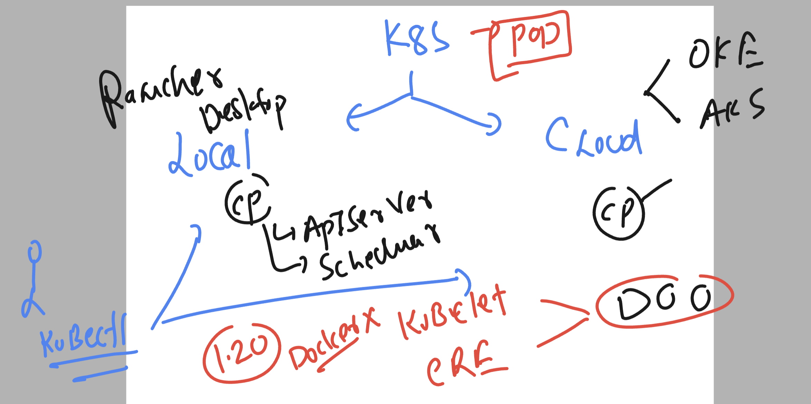
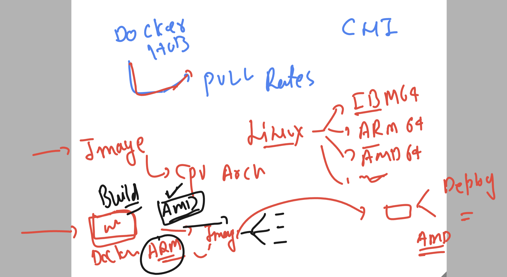
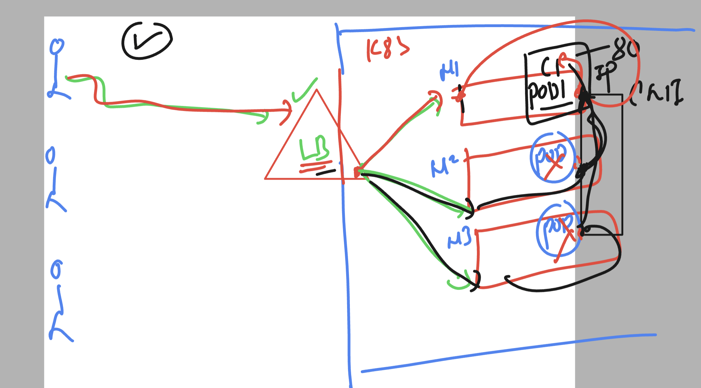
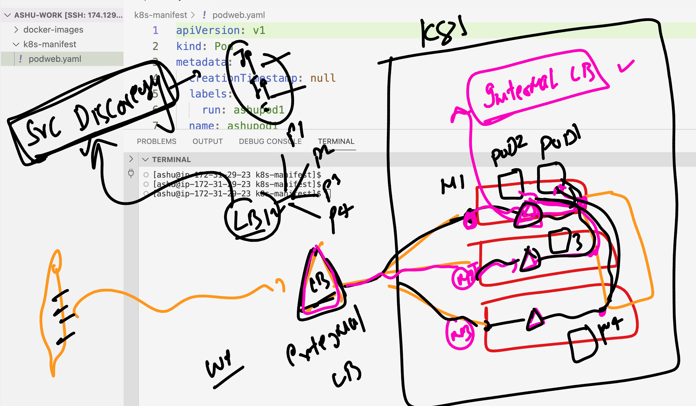
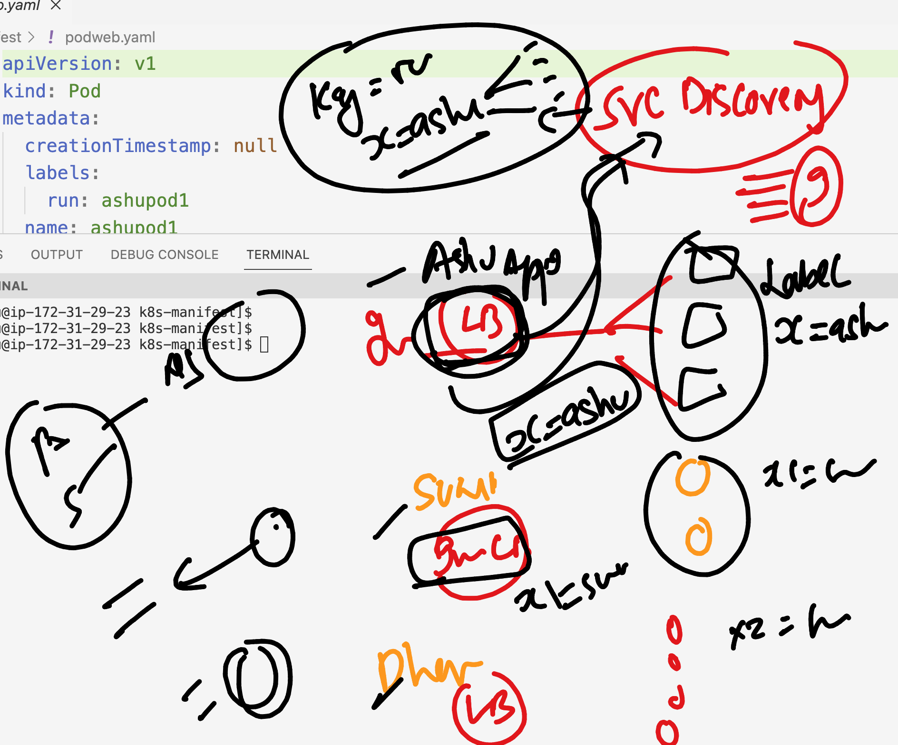

### revision 



### Understanding docker image build cpu depedencies 



### Creating ns and configure it 

```
[ashu@ip-172-31-29-23 ashu-work]$ kubectl  create  ns  ashu-apps
namespace/ashu-apps created
[ashu@ip-172-31-29-23 ashu-work]$ kubectl config set-context --current --namespace  ashu-apps
Context "oracle_training" modified.
[ashu@ip-172-31-29-23 ashu-work]$ 
[ashu@ip-172-31-29-23 ashu-work]$ 
[ashu@ip-172-31-29-23 ashu-work]$ kubectl config get-contexts 
CURRENT   NAME              CLUSTER           AUTHINFO                            NAMESPACE
*         oracle_training   oracle_training   clusterUser_k8sty_oracle_training   ashu-apps
[ashu@ip-172-31-29-23 ashu-work]$ 
[ashu@ip-172-31-29-23 ashu-work]$ kubectl  get pods
No resources found in ashu-apps namespace.
[ashu@ip-172-31-29-23 ashu-work]$ 

```
### verify 

```
ashu@ip-172-31-29-23 ashu-work]$ docker version 
Client:
 Version:           20.10.25
 API version:       1.41
 Go version:        go1.20.12
 Git commit:        b82b9f3
 Built:             Fri Dec 29 20:37:18 2023
 OS/Arch:           linux/amd64
 Context:           default
 Experimental:      true

Server:
 Engine:
  Version:          20.10.25
  API version:      1.41 (minimum version 1.12)
  Go version:       go1.20.12
  Git commit:       5df983c
  Built:            Fri Dec 29 20:38:05 2023
  OS/Arch:          linux/amd64
  Experimental:     false
 containerd:
  Version:          1.7.2
  GitCommit:        0cae528dd6cb557f7201036e9f43420650207b58
 runc:
  Version:          1.1.11
  GitCommit:        4bccb38cc9cf198d52bebf2b3a90cd14e7af8c06
 docker-init:
  Version:          0.19.0
  GitCommit:        de40ad0
[ashu@ip-172-31-29-23 ashu-work]$ kubectl  config get-contexts 
CURRENT   NAME              CLUSTER           AUTHINFO                            NAMESPACE
*         oracle_training   oracle_training   clusterUser_k8sty_oracle_training   ashu-apps
[ashu@ip-172-31-29-23 ashu-work]$ 
```

### fresh image build compatible to multiple cpu family

```
ashu@ip-172-31-29-23 ashu-work]$ ls
docker-images  k8s-manifest
[ashu@ip-172-31-29-23 ashu-work]$ cd  docker-images/
[ashu@ip-172-31-29-23 docker-images]$ ls
[ashu@ip-172-31-29-23 docker-images]$ git clone https://github.com/schoolofdevops/html-sample-app.git
Cloning into 'html-sample-app'...
remote: Enumerating objects: 74, done.
remote: Counting objects: 100% (74/74), done.
remote: Compressing objects: 100% (69/69), done.
remote: Total 74 (delta 5), reused 71 (delta 5), pack-reused 0
Receiving objects: 100% (74/74), 1.38 MiB | 24.80 MiB/s, done.
Resolving deltas: 100% (5/5), done.
[ashu@ip-172-31-29-23 docker-images]$ ls
html-sample-app
[ashu@ip-172-31-29-23 docker-images]$ ls
Dockerfile  html-sample-app
[ashu@ip-172-31-29-23 docker-images]$ 
```

### Dockerfile 

```
FROM nginx 
LABEL name="ashutoshh"
COPY html-sample-app /usr/share/nginx/html/
```

### build and push 

```
[ashu@ip-172-31-29-23 docker-images]$ ls
Dockerfile  html-sample-app
[ashu@ip-172-31-29-23 docker-images]$ docker build -t  dockerashu/ashu-oraclewebapp:linuxamdv1 . 
Sending build context to Docker daemon  3.629MB
Step 1/3 : FROM nginx
latest: Pulling from library/nginx
2f44b7a888fa: Pull complete 
8b7dd3ed1dc3: Pull complete 
35497dd96569: Pull complete 
36664b6ce66b: Pull complete 
2d455521f76c: Pull complete 
dc9c4fdb83d6: Pull complete 
8056d2bcf3b6: Pull complete 
Digest: sha256:4c0fdaa8b6341bfdeca5f18f7837462c80cff90527ee35ef185571e1c327beac
Status: Downloaded newer image for nginx:latest
 ---> a8758716bb6a
Step 2/3 : LABEL name="ashutoshh"
 ---> Running in 79198fe0a255
Removing intermediate container 79198fe0a255
 ---> 066df059746e
Step 3/3 : COPY html-sample-app /usr/share/nginx/html/
 ---> d7b4943e938b
Successfully built d7b4943e938b
Successfully tagged dockerashu/ashu-oraclewebapp:linuxamdv1
[ashu@ip-172-31-29-23 docker-images]$ docker login 
Login with your Docker ID to push and pull images from Docker Hub. If you don't have a Docker ID, head over to https://hub.docker.com to create one.
Username: dockerashu
Password: 
WARNING! Your password will be stored unencrypted in /home/ashu/.docker/config.json.
Configure a credential helper to remove this warning. See
https://docs.docker.com/engine/reference/commandline/login/#credentials-store

Login Succeeded
[ashu@ip-172-31-29-23 docker-images]$ docker push dockerashu/ashu-oraclewebapp:linuxamdv1
The push refers to repository [docker.io/dockerashu/ashu-oraclewebapp]
1c4510ca6411: Pushed 
009507b85609: Mounted from library/nginx 
fbcc9bc44d3e: Mounted from library/nginx 
b4ad47845036: Mounted from library/nginx 
eddcd06e5ef9: Mounted from library/nginx 
b61d4b2cd2da: Mounted from library/nginx 
b6c2a8d6f0ac: Mounted from library/nginx 
571ade696b26: Mounted from library/nginx 
```

### best way to build image as per industry standard 

### dockerfile 

```
ARG arch 
# use of arg to accept values in variable during build time 
FROM  --platform=${arch}  nginx
LABEL name="ashutoshh"
COPY html-sample-app /usr/share/nginx/html/
```

### build command 

```
docker build -t  dockerashu/ashu-oraclewebapp:appv2  --build-arg arch=arm64 --no-cache .
```

### Deploying pod from docker hub amd based image

```
ashu@ip-172-31-29-23 docker-images]$ cd ../k8s-manifest/
[ashu@ip-172-31-29-23 k8s-manifest]$ ls
[ashu@ip-172-31-29-23 k8s-manifest]$ kubectl run ashupod1 --image=dockerashu/ashu-oraclewebapp:linuxamdv1 --port 80 --dry-run=client  -o yaml >podweb.yaml 
[ashu@ip-172-31-29-23 k8s-manifest]$ kubectl create -f podweb.yaml 
pod/ashupod1 created
[ashu@ip-172-31-29-23 k8s-manifest]$ kubectl  get  pods
NAME       READY   STATUS    RESTARTS   AGE
ashupod1   1/1     Running   0          8s
[ashu@ip-172-31-29-23 k8s-manifest]$ 

```


### CNi network traffic distribution 



### internal Loadbalancer will be using service discovery to find all the pods of same app



### internal LB will be finding relevent pod ip using label concept 



