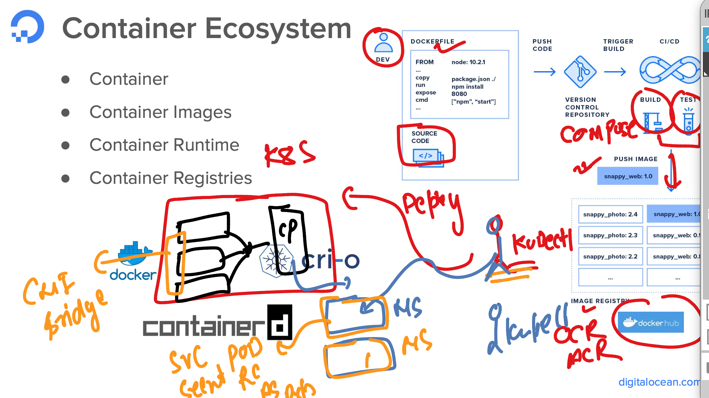
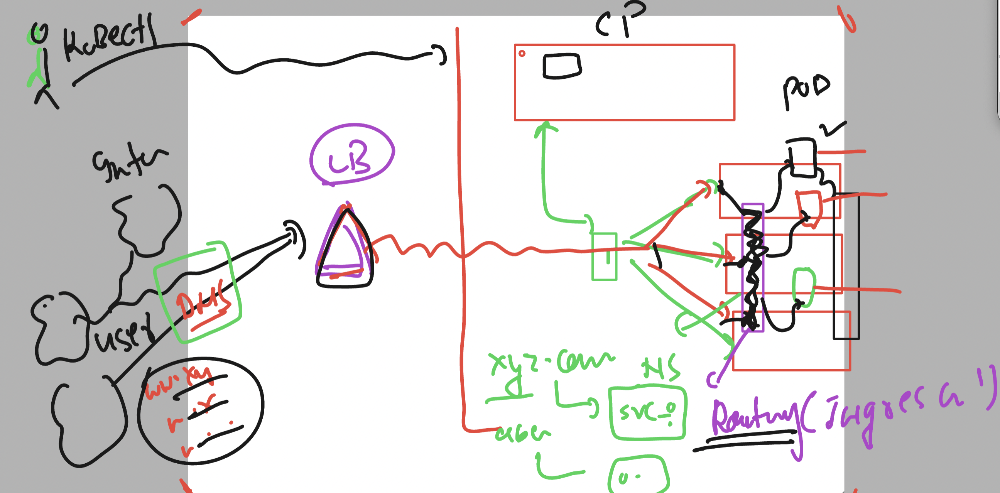
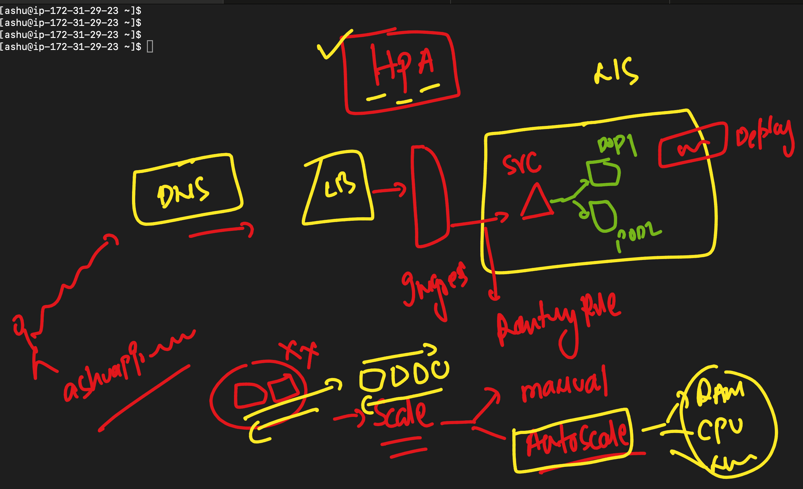
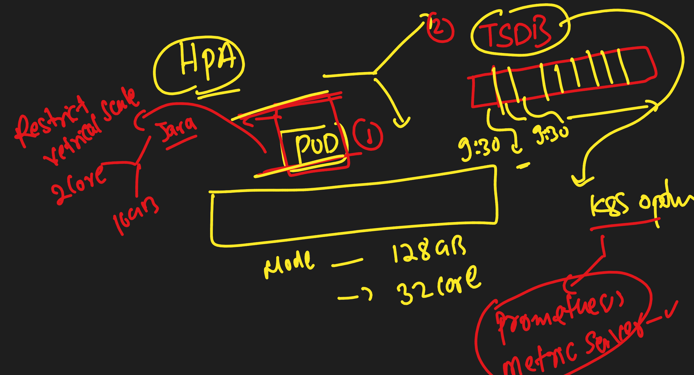

### REvision 


### Application access using Ingress controller 



### Verify last deployment of mysql db 

```
[ashu@ip-172-31-29-23 ashu-work]$ kubectl  get  deploy
NAME           READY   UP-TO-DATE   AVAILABLE   AGE
ashu-mysqldb   1/1     1            1           17h
[ashu@ip-172-31-29-23 ashu-work]$ kubectl  get po 
NAME                            READY   STATUS    RESTARTS   AGE
ashu-mysqldb-769b844464-vpgzd   1/1     Running   0          16h
[ashu@ip-172-31-29-23 ashu-work]$ kubectl  get secret
NAME            TYPE                             DATA   AGE
ashu-app-db     Opaque                           3      17h
ashu-cred-reg   kubernetes.io/dockerconfigjson   1      18h
ashu-dbpass     Opaque                           1      18h
[ashu@ip-172-31-29-23 ashu-work]$ kube get  svc
NAME    TYPE        CLUSTER-IP     EXTERNAL-IP   PORT(S)    AGE
db-lb   ClusterIP   10.0.111.196   <none>        3306/TCP   17h
[ashu@ip-172-31-29-23 ashu-work]$ 

```

### Creating web app 

```
kubectl  create deployment ashu-web --image=wordpress:6.2.1-apache --port 80 --dry-run=client -o yaml >web_deploy.yaml
```

### updating manifest file to connect backend database 

```
apiVersion: apps/v1
kind: Deployment
metadata:
  creationTimestamp: null
  labels:
    app: ashu-web
  name: ashu-web
spec:
  replicas: 1
  selector:
    matchLabels:
      app: ashu-web
  strategy: {}
  template:
    metadata:
      creationTimestamp: null
      labels:
        app: ashu-web
    spec:
      containers:
      - image: wordpress:6.2.1-apache
        name: wordpress
        ports:
        - containerPort: 80
        env: # using ENV to connect Db 
        - name: WORDPRESS_DB_HOST 
          value: db-lb # service name of DB 
        - name: WORDPRESS_DB_USER
          valueFrom:
            secretKeyRef:
              name: ashu-app-db
              key: MYSQL_USER
        - name: WORDPRESS_DB_PASSWORD 
          valueFrom:
            secretKeyRef:
              name: ashu-app-db
              key:  MYSQL_PASSWORD
        resources: {}
status: {}

```

### Creating configmap to store db host detail

```
kubectl create configmap ashu-app-connect  --from-literal dbconn=db-lb  --dry-run=client -o yaml >appcm.yaml 
[ashu@ip-172-31-29-23 twotapp]$ kubectl apply -f appcm.yaml 
configmap/ashu-app-connect created
[ashu@ip-172-31-29-23 twotapp]$ kubectl  get  cm
NAME               DATA   AGE
ashu-app-connect   1      3s
kube-root-ca.crt   1      24h
```

### updating manifest

```
apiVersion: apps/v1
kind: Deployment
metadata:
  creationTimestamp: null
  labels:
    app: ashu-web
  name: ashu-web
spec:
  replicas: 1
  selector:
    matchLabels:
      app: ashu-web
  strategy: {}
  template:
    metadata:
      creationTimestamp: null
      labels:
        app: ashu-web
    spec:
      containers:
      - image: wordpress:6.2.1-apache
        name: wordpress
        ports:
        - containerPort: 80
        env: # using ENV to connect Db 
        - name: WORDPRESS_DB_HOST 
          valueFrom: # reading value of DB host from ConfigMAP 
            configMapKeyRef:
              name: ashu-app-connect
              key: dbconn
        - name: WORDPRESS_DB_USER
          valueFrom:
            secretKeyRef:
              name: ashu-app-db
              key: MYSQL_USER
        - name: WORDPRESS_DB_PASSWORD 
          valueFrom:
            secretKeyRef:
              name: ashu-app-db
              key:  MYSQL_PASSWORD
        resources: {}
status: {}

```

### deploy web app also 

```
[ashu@ip-172-31-29-23 twotapp]$ ls
appcm.yaml  dbdeploy.yaml  dbsecret.yaml  dbsvc.yaml  web_deploy.yaml
[ashu@ip-172-31-29-23 twotapp]$ kubectl apply -f   . 
configmap/ashu-app-connect configured
deployment.apps/ashu-mysqldb configured
secret/ashu-app-db configured
service/db-lb configured
deployment.apps/ashu-web created
[ashu@ip-172-31-29-23 twotapp]$ kubectl  get  deploy 
NAME           READY   UP-TO-DATE   AVAILABLE   AGE
ashu-mysqldb   1/1     1            1           17h
ashu-web       1/1     1            1           14s
[ashu@ip-172-31-29-23 twotapp]$ kubectl  get  po 
NAME                            READY   STATUS    RESTARTS   AGE
ashu-mysqldb-769b844464-vpgzd   1/1     Running   0          16h
ashu-web-6d69b75dd8-tvpgn       1/1     Running   0          19s
[ashu@ip-172-31-29-23 twotapp]$ 
```

### Creating new web deployment 

```
 kubectl  create deployment  d1 --image=adminer  --port 8080 
```
### Creating svc of web 

```
[ashu@ip-172-31-29-23 twotapp]$ kubectl  get  deploy
NAME           READY   UP-TO-DATE   AVAILABLE   AGE
ashu-mysqldb   1/1     1            1           18h
d1             1/1     1            1           4m3s
[ashu@ip-172-31-29-23 twotapp]$ kubectl  get  svc
NAME    TYPE        CLUSTER-IP     EXTERNAL-IP   PORT(S)    AGE
db-lb   ClusterIP   10.0.111.196   <none>        3306/TCP   18h
[ashu@ip-172-31-29-23 twotapp]$ 
[ashu@ip-172-31-29-23 twotapp]$ 
[ashu@ip-172-31-29-23 twotapp]$ kubectl expose deployment d1  --type ClusterIP --port 8080 --name ashuweblb --dry-run=client -o yaml >websvc.yaml 
[ashu@ip-172-31-29-23 twotapp]$ kubectl  create -f websvc.yaml 
service/ashuweblb created
[ashu@ip-172-31-29-23 twotapp]$ kubectl  get  svc
NAME        TYPE        CLUSTER-IP     EXTERNAL-IP   PORT(S)    AGE
ashuweblb   ClusterIP   10.0.51.60     <none>        8080/TCP   5s
db-lb       ClusterIP   10.0.111.196   <none>        3306/TCP   18h
[ashu@ip-172-31-29-23 twotapp]$ 
```

### Deploy nginx ingress controller in k8s 

```
kubectl apply -f https://raw.githubusercontent.com/kubernetes/ingress-nginx/controller-v1.8.2/deploy/static/provider/cloud/deploy.yaml
namespace/ingress-nginx created
serviceaccount/ingress-nginx created
serviceaccount/ingress-nginx-admission created
role.rbac.authorization.k8s.io/ingress-nginx created
role.rbac.authorization.k8s.io/ingress-nginx-admission created
clusterrole.rbac.authorization.k8s.io/ingress-nginx created
clusterrole.rbac.authorization.k8s.io/ingress-nginx-admission created
rolebinding.rbac.authorization.k8s.io/ingress-nginx created

```

### Official Docs for nginx ingress controller 

[click_here](https://kubernetes.github.io/ingress-nginx/deploy/)

### Verify installation of Nginx ingress controller 

```
apiVersion: networking.k8s.io/v1
kind: Ingress
metadata:
  name: ashu-app-rule-ingress # name of routing rule 
  annotations:
    nginx.ingress.kubernetes.io/rewrite-target: /
spec:
  ingressClassName: nginx # class is nginx 
  rules:
  - host: ashuapp.adhocnet.org  # my app host name 
    http:
      paths:
      - path: / # app path which is home page 
        pathType: Prefix
        backend:
          service:
            name: ashuweblb # name of webapp svc 
            port:
              number: 8080 # port of webapp svc 
```

### Creating 

```
[ashu@ip-172-31-29-23 twotapp]$ kubectl create -f web-ingress.yaml 
ingress.networking.k8s.io/ashu-app-rule-ingress created
[ashu@ip-172-31-29-23 twotapp]$ kubectl  get ingress 
NAME                    CLASS   HOSTS                  ADDRESS   PORTS   AGE
ashu-app-rule-ingress   nginx   ashuapp.adhocnet.org             80      5s
[ashu@ip-172-31-29-23 twotapp]$ 


```

### list of Resources in k8s 

```
[ashu@ip-172-31-29-23 ~]$ kubectl api-resources 
NAME                                SHORTNAMES          APIVERSION                             NAMESPACED   KIND
bindings                                                v1                                     true         Binding
componentstatuses                   cs                  v1                                     false        ComponentStatus
configmaps                          cm                  v1                                     true         ConfigMap
endpoints                           ep                  v1                                     true         Endpoints
events                              ev                  v1                                     true         Event
limitranges                         limits              v1                                     true         LimitRange
namespaces                          ns                  v1                                     false        Namespace
nodes                               no                  v1                                     false        Node
persistentvolumeclaims              pvc                 v1                                     true         PersistentVolumeClaim
persistentvolumes                   pv                  v1                                     false        PersistentVolume
pods                                po                  v1                                     true         Pod

```

### HPA in k8s 



### HPA need 



### implementing HPA 

```
ashu@ip-172-31-29-23 k8s-manifest]$ kubectl  get  deploy
NAME          READY   UP-TO-DATE   AVAILABLE   AGE
ashu-hpaweb   1/1     1            1           2m9s
[ashu@ip-172-31-29-23 k8s-manifest]$ 
[ashu@ip-172-31-29-23 k8s-manifest]$ kubectl autoscale deployment ashu-hpaweb --cpu-percent 70 --min 2 --max 15  --dry-run=client -o yaml >hparule.yaml 
[ashu@ip-172-31-29-23 k8s-manifest]$ kubectl  get po 
NAME                          READY   STATUS    RESTARTS   AGE
ashu-hpaweb-569d754b5-4cg9f   1/1     Running   0          3m58s
[ashu@ip-172-31-29-23 k8s-manifest]$ 
[ashu@ip-172-31-29-23 k8s-manifest]$ 
[ashu@ip-172-31-29-23 k8s-manifest]$ kubectl create -f hparule.yaml 
horizontalpodautoscaler.autoscaling/ashu-hpaweb created
[ashu@ip-172-31-29-23 k8s-manifest]$ 
[ashu@ip-172-31-29-23 k8s-manifest]$ kubectl get hpa
NAME          REFERENCE                TARGETS         MINPODS   MAXPODS   REPLICAS   AGE
ashu-hpaweb   Deployment/ashu-hpaweb   <unknown>/70%   2         15        0          4s
[ashu@ip-172-31-29-23 k8s-manifest]$ kubectl  get  po 
NAME                          READY   STATUS    RESTARTS   AGE
ashu-hpaweb-569d754b5-4cg9f   1/1     Running   0          4m17s
```


